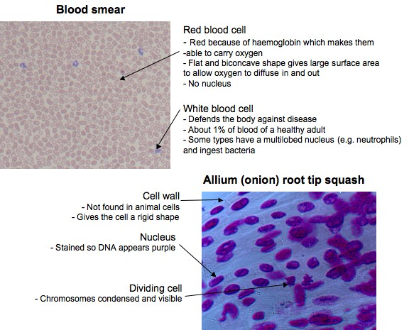
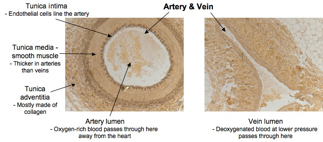
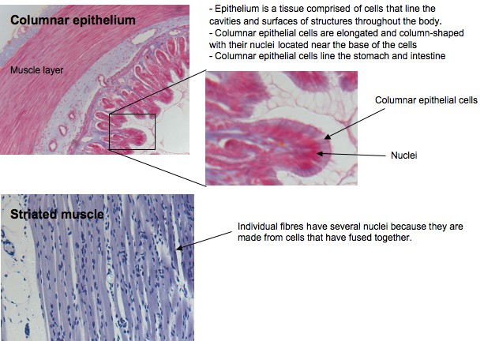
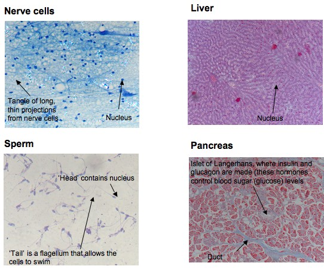
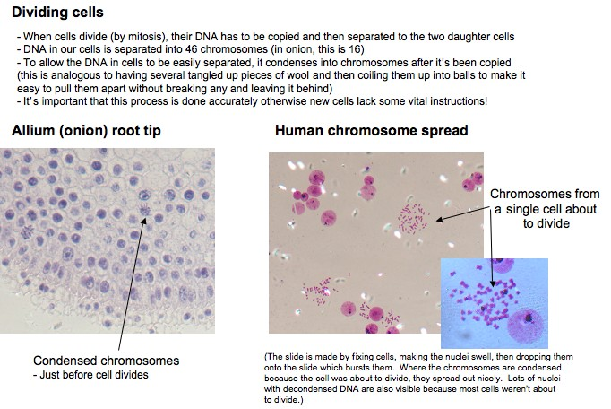
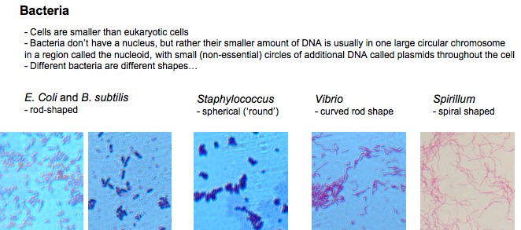
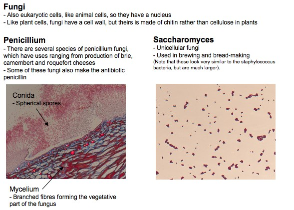

# Microscopes & Cells

**Examining a variety of objects under a microscope, including a variety of slides** - All sorts of things can be viewed down a microscope! This might include the biology lesson classic of an onion skin, the shapes of salt and sugar crystals, the eye of the insect you found in your tent, a drop of puddle water... 

Last initially checked on 2024-02-15 by John Leung (cfl35@cam.ac.uk) and double-checked on 2024-02-15 by Isobel Gilham (ig419@cam.ac.uk)

## Tags
<!--- Start Tags (DO NOT REMOVE THIS COMMENT) --->

**Standard** (A standard CHaOS experiment, useable for all hands-on events.)

**Biology**

**Active** (Experiment has working equipment at the time of last update, and is available for events.)
<!--- End Tags (DO NOT REMOVE THIS COMMENT) --->

 

## Equipment Needed 
- **Electricity needed**
- Microscopes
- Slides
- Model cells (pillow model and inflatable plant and animal cells)
- Video camera for microscope and laptop

 

## Experiment Explanation 

### Microscope kit for 2011 Summer Roadshow

Microscopes are now in five boxes. Note that not all five boxes are required to run the experiment - at the minimum, it requires the microscope slides box and one microscopy box. 

**2 x Slide microscopes:**
Two small blue boxes- each set is labelled alpha or beta to help stop them getting muddled up. In each box there’s the main body of the microscope (stored in two pieces, undo the screw, slot together, tighten screw), and 4 lenses in small pots. Unscrew the lenses from the lids of the pots, and screw them in to the lower part of the microscope. The upper lenses are stored in the same box as the microscope slides- you won’t really need them if you’re using the microscope cameras and the CHaOS laptops to show visitors the slides, but feel free to. Ask a Committee member to help you set up if you’re not sure! 

**Dissecting microscopes:**
Small grey box. This is good for introducing microscopes in primary schools, though you’ll need to find some props to use with it. Everyday objects like money and textiles are good to look at with this. You can always raid the CHaOS food boxes for stuff like lettuce, kiwis and tomatoes, or look outside for a selection of leaves. Doesn't require electricity. 

**Microscope slides:**
This box contains:
• 6 x boxes of slides for the slide microscopes (labelled man-made materials, human body, invertebrates, plants, parasites and microbes)
• A box of lenses for the slide microscopes (labelled alpha and beta)
• A box of accessories for the microscopes (dust covers and anything else you might want)
• A magnifying glass (to show that lenses can make an image bigger)
• A ruler (which can sometimes help to explain scale)
• Cameras for the microscopes (1 x silver, 1 x black and 2 x low res for backup), which work like webcams when attached to the CHaOS microscopes. (The software has shortcuts on the desktop of each of the CHaOS laptops)
• Laminated sheets with extra info for the 3 x slides in a pond life food chain that are in the invertebrate box (water organisms -> daphnia -> hydra)
• 3 x microscope books, which might give you some ideas for demos

**Model cells:**
Contains one dissecting microscope. 

**Digital microscope:**
Contains a digital microscope. 

 How to explain what microcopes do/ what cells are
--------------------------------------------------

There are lots of different slides to choose from – feel free to talk about whatever you’re interested in!
- Introduce cells using the cell models 
- Cells are very small (typically 10 um for an animal cell... that's 1000 times smaller than 1 cm (you can use the ruler to show 1 cm)
- Cells are analogous to a building brick - houses are built of lots of bricks, like people are built of lots of cells (50-75 trillion!)
- Cells aren't just bricks - they are alive, and make things, use things, and process information
- Have a phospholipid membrane – barrier to extracellular environment 
- Nucleus is the ‘control centre’ - contains instructions on how to make proteins, from which the rest of the cell is made. Instructions are written in a 4-letter code on very long molecules called DNA (see Kiwi DNA experiment). DNA to mRNA (transcription), transported out of nucleus, translation on ribosomes to proteins. Proteins go to the ER (endoplasmic reticulum) for further folding, then to Golgi apparatus (more modifications), then on export pathway to exit the cell.
- Cells need energy - this is supplied by mitochondria (they convert energy from sugars into ATP, the energy currency of the cell)
- Plant cells - cell walls and chloroplasts (we have a root tip squash slide where the cell walls are visible and the nuclei are nicely stained, but they don't have chloroplasts because it's a root. If they want to see more plant cells, there's a whole demo on plants...)
- Bacteria are also cells, but they are smaller and don't have a nucleus (associate bacteria with disease e.g. food poisoning caused by E. coli). Bacteria can be lots of different shapes (look at E. coli, Staphylococcus, Spirillum).
- See below for labelled diagrams of some of the slides!

### Microbes: Parasites slides

Flukes (Trematodes): Adult flukes are leaf-shaped flatworms. Prominent oral and ventral suckers help maintain position. Flukes are hermaphroditic (both male and female) except for blood flukes, which are bisexual. The life-cycle includes a snail intermediate host.

Tapeworms (Cestodes): Adult tapeworms are elongated, segmented, hermaphroditic flatworms that inhabit the intestinal lumen. You can eat the cysts in undercooked animal tissues, and then they develop in your intestines. They eat your food from your intestine – instead of you getting the nutrients. They attach to the intestinal wall using suckers in the head. Problematic in the developing world where there is already malnutrition. People used to use tapeworms as a slimming aid… They can grow up to 15 metres long and live for 20 years! Larval forms live in extraintestinal tissues. 

Roundworms (Nematodes): Adult and larval roundworms are bisexual, cylindrical worms. They inhabit intestinal and extraintestinal sites.

1) **Schistosomiasis** (caused by a fluke/ trematode)
- Schistosomiasis is a chronic, parasitic disease caused by blood flukes (schistosomes)
- At least 230 million people require treatment every year – praziquantel 
- Infection from larval forms released from freshwater snails in contaminated water
- Penetrate the skin and live in circulation where females release eggs
- Cause damage because of the host immune response to the parasites

1) **Liver fluke** (*Fasciola hepatica*) (caused by a fluke)
- Freshwater snail intermediate host, where reproduction occurs, then they are released as cercariae and swim through water to be ingested by ruminants normally, or sometimes humans eating uncooked foods like watercress
- Adult lives in the liver where they feed on the lining of bile ducts – makes cheese-like holes in the liver
- Produce eggs – up to 25000 a day per female

1) **Dracunculiasis** (guinea-worm disease, caused by a nematode) 
- Dracunculiasis (caused by Dracunculus medinensis, a long thread-like worm) is a parasitic disease on the verge of eradication
- Exclusively transmitted by drinking water contaminated with parasite-infected fleas such as rural isolated ponds
- Takes 10-14 months for worm to mature in the body

1) **Hookworm** (*Ancylostoma duodenale* and *Necator americanus*, kinds of nematodes) 
- Soil-transmitted helminths (parasitic worms)
- Major burden of disease worldwide - estimated 576-740 million people infected with hookworm
- Hookworms live in the small intestine, eggs are passed in faeces of infected person – this is a problem in the developing world where people may defecate outside (near bushes, in a garden, or field) of if the faeces of an infected person are used as fertilizer, eggs are deposited on soil. 
- Eggs then mature and hatch, releasing larvae (immature worms). 
- The larvae mature into a form that can penetrate the skin of humans, and infection is mainly acquired by walking barefoot on contaminated 
- Most people infected with hookworms have no symptoms. Some have gastrointestinal symptoms, especially persons who are infected for the first time. The most serious effects of hookworm infection are blood loss leading to anemia, in addition to protein loss. 
- Infection is treatable – anthelminthic medications eg. albenadazole

#### PARASITE VECTORS:

(There are two cuddly toys for this, so you can show a second uninfected mosquito feeding off a human host)

1) **Mosquito**: 
- Most mosquitoes are harmless but some can transmit disease
- Viral diseases, such as yellow fever, dengue fever and Chikungunya, transmitted mostly by Aedes aegypti
- Parasitic disease malaria, carried by mosquitoes of the genus Anopheles 
- Lymphatic filariasis (the main cause of elephantiasis – worms block lymphatics impairing lymph drainage causing swelling of the limbs) 
- We have cuddly toys of mosquitoes – in the parasites box

#### ECTOPARASITES:

(You can borrow cuddly toys (in parasites box) and some preserved samples (from "Horrible Housemates") to help you demonstrate.)

1) **Head louse** (*Pediculus humanus capitis*)
- Lice are wingless biting or sucking insects. Lice infestation of any part of the body is called pediculosis! 
- Live on your head (an ectoparasite) - has a single strong claw on each leg that can grab onto 6 hairs so they can move rapidly (may be on several heads in one day). But their short stumpy legs mean they can’t jump or walk well on flat surfaces.
- Your head provides a source of food - blood
- Eggs are called nits and the female attaches the eggs close to the scalp with a transparent quick-setting glue
- The time taken to hatch depends upon temperature
- Head lice have no lungs! They take in air by muscle contraction of the abdomen (via spiracles) 
- Head lice have been recovered from prehistoric mummies!

2) **Bed bug** (*Cimex lectularius*)
- Ectoparasites that feed on human blood (haematophagous)
- Live in houses and especially beds – most active at night so they can feed on the host without being noticed
- Adults can survive more than a year without feeding
- They don’t usually spread disease but they can cause allergic skin reactions
- Light brown flattened oval-shaped body, vestigial front wings, microscopic hairs on abdomen that give a banded appearance 

#### HYDRA:
 
- Hydra live in freshwater (unlike other members of their phylum, Cnidaria, like coral)
- Attached via basal disc to a surface like rocks
- Hydra eat small water organisms like water fleas
- Have nematocysts – tiny stinging cells that inject toxin into their prey to paralyze them. The tentacles are sticky. The tentacles then move to bring the prey to their mouths, then prey is enzymatically digested. Sometimes they ‘swallow’ their tentacles so have to pull them back out.
- There’s only one entrance and exit to the internal cavity – so indigestible parts come back out the same way!
- Hydra mostly reproduce by budding – young polyps mature attached to the parent and then detach. There is also some seasonal sexual reproduction with mature polyps developing gonads on the external body wall.
- Hydra have an amazing ability to regenerate. If you cut them in half, the head will grow a new foot and the foot a new head!

 

## Risk Assessment

### **Hazard**: Microscopes

**Description**: Electrical hazard, especially near possible water-based samples.

**Affected People**: All

**Before Mitigation**: Likelihood: 2, Severity: 3, Overall: 6

**Mitigation**: Keep water-based samples away from the microscope. Take care. See separate electrical parts risk assessment.
In case of accident, call first aider.

**After Mitigation**: Likelihood: 1, Severity: 3, Overall: 3

 

### **Hazard**: Glass slides

**Description**: Using thin glass slide could result in broken glass with risk of cuts.

**Affected People**: All

**Before Mitigation**: Likelihood: 3, Severity: 3, Overall: 9

**Mitigation**: If children are very young or being silly, the slides should only be handled by the demonstrator - this will reduce the risk of breakage. If slides are broken, carefully collect/sweep up broken pieces, wrap in paper and dispose of carefully.
In case of accident, call first aider.

**After Mitigation**: Likelihood: 2, Severity: 3, Overall: 6

 

### **Hazard**: Microscope light fitting

**Description**: The light fitting under the microscope becomes hot, and could cause burns.

**Affected People**: All

**Before Mitigation**: Likelihood: 3, Severity: 3, Overall: 9

**Mitigation**: Warn children to be careful, turn off lamp when not in use, if it's getting hot put a cardboard shield around (but not touching) the lamp to prevent accidental contact. 
In case of accident, call first aider. In case of burns, encourage victim to run affected area under tepid water for 10 minutes.

**After Mitigation**: Likelihood: 2, Severity: 3, Overall: 6

 

### **Hazard**: Model cells

**Description**: Inflating model cells could cause pulmonary distress e.g. asthma attacks.

**Affected People**: Demonstrator

**Before Mitigation**: Likelihood: 2, Severity: 3, Overall: 6

**Mitigation**: Avoid inflating the model cells if a sufferer of asthma. In case of incident, use inhaler. Call first aider.

**After Mitigation**: Likelihood: 1, Severity: 3, Overall: 3

 

### **Hazard**: Model cells

**Description**: Model cells could present a trip hazard if dropped on the floor.

**Affected People**: All

**Before Mitigation**: Likelihood: 2, Severity: 2, Overall: 4

**Mitigation**: Keep all props in contained area. If dropped, pick up immediately.
In case of accident, call first aider.

**After Mitigation**: Likelihood: 1, Severity: 2, Overall: 2

 

## Risk Assessment Check History 

**Check 1**: 2012-01-17 - Michael Darling (md510@cam.ac.uk), **Check 2**: 2012-01-24 - Alex Davies (ad578@cam.ac.uk)

**Check 1**: 2012-12-28 - Beatrice Tyrrell (bet23@cam.ac.uk), **Check 2**: 2012-12-30 - Richard "Miffles" Mifsud (rwm41@cam.ac.uk)

**Check 1**: 2013-12-26 - Richard "Miffles" Mifsud (rwm41@cam.ac.uk), **Check 2**: 2014-02-02 - Raghd Rostom (rr415@cam.ac.uk)

**Check 1**: 2015-01-05 - Arporn Wangwiwatsin (Koi) (aw584@cantab.net), **Check 2**: 2015-01-08 - Kym Neil (kym.e.neil@gmail.com)

**Check 1**: 2015-12-30 - Natalie Cree (nc434@cam.ac.uk), **Check 2**: 2016-02-11 - Craig Burns (cpb57@cam.ac.uk)

**Check 1**: 2017-01-11 - Roxanne Armfield (rea41@cam.ac.uk), **Check 2**: 2017-02-08 - Alfred Chia (ac939@cam.ac.uk)

**Check 1**: 2018-01-08 - Gemma Shaw (gcs33@cam.ac.uk), **Check 2**: 2018-02-02 - Richard "Miffles" Mifsud (rwm41@cam.ac.uk)

**Check 1**: 2019-01-12 - Amanda Buckingham (abb53@cam.ac.uk), **Check 2**: 2019-01-14 - Polly Hooton (prh43@cam.ac.uk)

**Check 1**: 2020-01-25 - Matt Worssam (mdw47@cam.ac.uk), **Check 2**: 2020-01-25 - Bryony Yates (by250@cam.ac.uk)

**Check 1**: 2020-12-28 - Bryony Yates (by250@cam.ac.uk), **Check 2**: 2021-01-12 - Richard "Miffles" Mifsud (rwm41@cam.ac.uk)

**Check 1**: 2022-02-09 - Jessica Trevelyan (jet81@cam.ac.uk), **Check 2**: 2022-02-09 - Maggie Goulden (mcg58@cam.ac.uk)

**Check 1**: 2023-02-10 - Amy Migunda (aom36@cam.ac.uk), **Check 2**: 2023-02-18 - Maggie Goulden (mcg58@cam.ac.uk)

**Check 1**: 2024-02-15 - John Leung (cfl35@cam.ac.uk), **Check 2**: 2024-02-15 - Isobel Gilham (ig419@cam.ac.uk)
