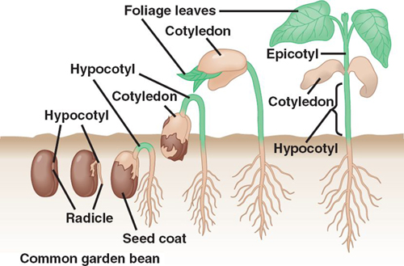
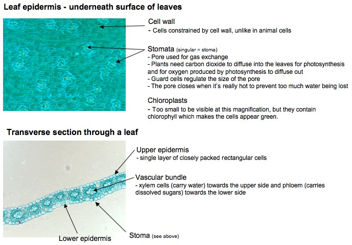
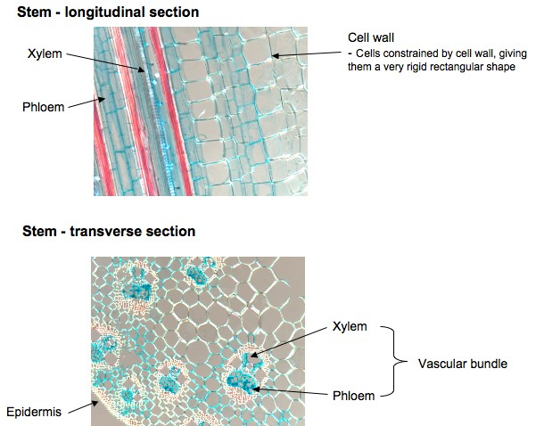
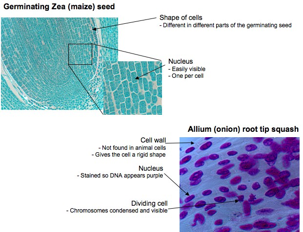

# Plants

**Plants - looking at germination, their structure and how they produce energy by photosynthesis** - nan

Last initially checked on 2025-11-29 by Jeremy Lee (rqjl2@cam.ac.uk) and double-checked on 

## Tags
<!--- Start Tags (DO NOT REMOVE THIS COMMENT) --->

**Biology**

**Active** (Experiment has working equipment at the time of last update, and is available for events.)

**CBS only** (Non-transportable experiments that tend to be used for CBS only.)
<!--- End Tags (DO NOT REMOVE THIS COMMENT) --->

 

## Equipment Needed 
- **Electricity needed**
- *Needs significant preparation in the days running up to the event*

- Beansprouts in plastic containers, germinated prior to event, under different conditions (e.g. light/dark/water/no water/warm/cold)
- Magnifying boxes
- Microscope and slides showing section through plant leaves, stem, stomata, germinating seed

 

## Experiment Explanation 

Ideas to explain:

**For younger children**

- Talk about what plants need to grow (water, warmth, light)
- Look at sequence of development i.e. seed, beansprout, small plant, larger plant, bigger plants flower and produce seeds (life cycle)
- Plants need light to produce energy - they don't eat like animals do (avoid using the term 'photosynthesis' with small children)
- Might want to look at plant cells in the microscope. They have a cell wall, so have a rigid shape, unlike animal cells. Green because of the pigment (chlorophyll) that they use to produce energy from light.

**For older children**

- More detail on the different events happening in early plant development

- More detail on photosynthesis i.e. carbon dioxide converted into sugars, and oxygen is produced (the opposite idea to respiration)
- Gas exchange (Carbon dioxide for oxygen) happens through pores on the underside of leaves called stomata (you should be able to see these on one of the slides - see below).
- Light is absorbed by the green pigment (chlorophyll) in the leaves
- Plants have to transport sugars made in the leaves to other parts of the plant - this happens in the phloem (visible on slides)
- Water is transported from the roots in xylem (visible on slides - see below)

   
 

## Risk Assessment

### **Hazard**: Microscope

**Description**: Electrical hazard (microscope), especially near sources of water.

**Affected People**: All

**Before Mitigation**: Likelihood: 2, Severity: 4, Overall: 8 (high)

**Mitigation**: See separate electrical parts risk assessment, keep microscope away from water as it is not required for this experiment.
In case of injury, call first aider.

**After Mitigation**: Likelihood: 1, Severity: 4, Overall: 4 (medium)

 

### **Hazard**: Thin glass slides

**Description**: Using thin glass slide could result in broken glass with risk of cuts.

**Affected People**: All

**Before Mitigation**: Likelihood: 2, Severity: 3, Overall: 6 (medium)

**Mitigation**: Demonstrators should handle the mounting of slides and keep it away from children. If slides are broken, carefully collect/sweep up broken pieces, wrap in paper and dispose of carefully.
In case of injury, call a first aider.

**After Mitigation**: Likelihood: 1, Severity: 3, Overall: 3 (low)

 

### **Hazard**: Microscope light fitting

**Description**: The light fitting under the microscope becomes hot, and could cause burns.

**Affected People**: All

**Before Mitigation**: Likelihood: 3, Severity: 3, Overall: 9 (high)

**Mitigation**: Warn children to be careful, turn off lamp when not in use. If it's getting hot, put a cardboard shield around (but not touching) the lamp to prevent accidental contact.
In case of accident, call a first aider and encourage children to run burns under tepid water for 10 minutes.

**After Mitigation**: Likelihood: 2, Severity: 2, Overall: 4 (medium)

 

### **Hazard**: Specimens

**Description**: Possible allergic reaction to seeds/plants/soil/leaf specimens. Possible illness from injesting samples. 

**Affected People**: Demonstrator/Public

**Before Mitigation**: Likelihood: 2, Severity: 3, Overall: 6 (medium)

**Mitigation**: Check beforehand for any allergens in demonstrators and ensure experiment allocations are appropriate. Ask parents if child is allergic to the plant we are using before beginning the demonstration. In case of adverse reaction, call a first aider. Tell children who have been touching soil to wash hands after experiment and supervise at all times so that children do not eat the sample. 

**After Mitigation**: Likelihood: 1, Severity: 3, Overall: 3 (low)

 

### **Hazard**: Seedling jars

**Description**: Injury from dropping seedling jars/plants.

**Affected People**: All

**Before Mitigation**: Likelihood: 2, Severity: 2, Overall: 4 (medium)

**Mitigation**: Have seedlings in plastic container, and use plastic plant pots (i.e. plastic cups). In case of injury, call a first aider.

**After Mitigation**: Likelihood: 1, Severity: 1, Overall: 1 (low)

 

### **Hazard**: Electrical cables

**Description**: Trip hazard from microscope cable/extension cord.

**Affected People**: All

**Before Mitigation**: Likelihood: 3, Severity: 3, Overall: 9 (high)

**Mitigation**: Avoid setting up so wires are in a walkway, tape down cables. In case of injury, call a first aider.

**After Mitigation**: Likelihood: 2, Severity: 3, Overall: 6 (medium)

 

## Risk Assessment Check History 

**Check 1**: 2012-01-17 - Michael Darling (md510@cam.ac.uk), **Check 2**: 2012-01-24 - Alex Davies (ad578@cam.ac.uk)

**Check 1**: 2012-12-28 - Beatrice Tyrrell (bet23@cam.ac.uk), **Check 2**: 2012-12-30 - Richard "Miffles" Mifsud (rwm41@cam.ac.uk)

**Check 1**: 2013-12-26 - Richard "Miffles" Mifsud (rwm41@cam.ac.uk), **Check 2**: 2014-02-02 - Raghd Rostom (rr415@cam.ac.uk)

**Check 1**: 2015-01-11 - Arporn Wangwiwatsin (Koi) (aw584@cantab.net), **Check 2**: 2015-01-23 - Kym Neil (kym.e.neil@gmail.com)

**Check 1**: 2016-01-07 - Natalie Cree (nc434@cam.ac.uk), **Check 2**: 2016-02-03 - Sarah Wiseman (sw628@cam.ac.uk)

**Check 1**: 2017-02-08 - Alfred Chia (ac939@cam.ac.uk), **Check 2**: 2017-02-09 - Matt Worssam (mdw47@cam.ac.uk)

**Check 1**: 2018-02-02 - Richard "Miffles" Mifsud (rwm41@cam.ac.uk), **Check 2**: 2018-02-07 - Sarah Wiseman (sw628@cam.ac.uk)

**Check 1**: 2019-01-20 - Matt Worssam (mdw47@cam.ac.uk), **Check 2**: 2019-01-21 - Amanda Buckingham (abb53@cam.ac.uk)

**Check 1**: 2020-01-08 - Matt Worssam (mdw47@cam.ac.uk), **Check 2**: 2020-01-25 - Beatrix Huissoon (beh37@cam.ac.uk)

**Check 1**: 2021-01-12 - Richard "Miffles" Mifsud (rwm41@cam.ac.uk), **Check 2**: 2021-01-22 - Andrew Sellek (ads79@cam.ac.uk)

**Check 1**: 2022-01-23 - Jessica Trevelyan (jet81@cam.ac.uk), **Check 2**: 2022-01-29 - Margaret Johncock (mllyj2@cam.ac.uk)

**Check 1**: 2023-02-15 - Amy Migunda (aom36@cam.ac.uk), **Check 2**: 2023-02-18 - Asmita Niyogi (an637@cam.ac.uk)

**Check 1**: 2024-02-15 - Margaret Johncock (mllyj2@cam.ac.uk), **Check 2**: 2024-02-15 - Isobel Gilham (ig419@cam.ac.uk)

**Check 1**: 2025-01-12 - Margaret Johncock (mllyj2@cam.ac.uk), **Check 2**: 2025-01-13 - Smiley Chan (scc93@cam.ac.uk)

**Check 1**: 2025-11-29 - Jeremy Lee (rqjl2@cam.ac.uk)
