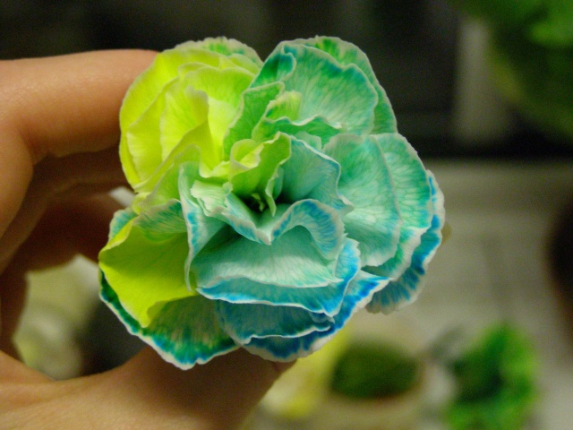
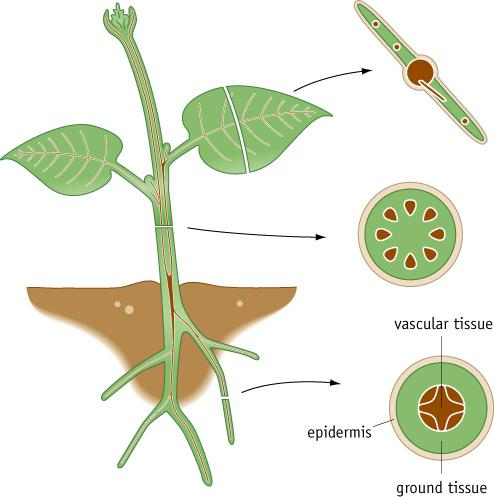
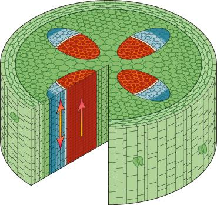

# Xylem

**Showing one of the transport systems in plants.** - Combine food colouring with water transport in stem and flowers- you can then see where all the water goes!

Last initially checked on 2024-02-01 by Margaret Johncock (mllyj2@cam.ac.uk) and double-checked on 2023-02-18 by Asmita Niyogi (an637@cam.ac.uk)

## Tags
<!--- Start Tags (DO NOT REMOVE THIS COMMENT) --->

**Biology**

**Active** (Experiment has working equipment at the time of last update, and is available for events.)

**CBS only** (Non-transportable experiments that tend to be used for CBS only.)
<!--- End Tags (DO NOT REMOVE THIS COMMENT) --->

 

## Equipment Needed 
- Need
- White carnations or gerberas (other white flowers might work, but these display colours nicely)
- Celery
- Food dyes (green tends to get lots of questions for flowers, red is best for celery)
- Scalpel (for preparation only, not needed in the demonstration)

 

## Experiment Explanation 

**Xylem vessels in plants**

Note: Sainsbury's own green food colouring does NOT work at all with white carnations (suspect all other flowers also). Silver spoon red food colouring doesn't work great with carnations. However the red did work well in celery. This was learnt at Cherry Hinton 2013. For future, we must try fountain pen ink or similar instead. 

For single coloured plants:
Add food dye to small amounts of water and add the plant stem (cut off a bit to speed up the process) – leave for at least 2 hours, but the longer you leave them the better they look (possibly even overnight)

For multicoloured plants:
Add different food dyes to different containers, and use the scalpel to slit the bottom ~5cm of the stem in half. Put the different cut parts in different colours, again leave for several hours (overnight isn’t ideal for these as the cut stems dry out). 

Celery:
Cut a fresh end on the celery and put the end in red food dye (diluted with water). Leave for a few hours and it should have nicely highlighted the xylem vessels that you can then talk about in relation to the microscope slides.

Single coloured and multicoloured examples (green clearly highlights vessels very well):

**Plants have ‘circulatory systems’ just like animals**

We need our blood vessels (like the veins you can see in your arms) to supply blood to all parts of our body. 

Plants also have vessels but they don’t transport blood, instead they transport water or sugar syrup.

Like we have veins to transport blood back to the heart and arteries to transport blood from the heart and around the rest of the body, plants also have two slightly different vessels. These are called ‘xylem’ and ‘phloem’. 

Xylem vessels (red) bring things up from the roots to the leaves of the plant. Phloem vessels (blue) transport things to the roots from the leaves.

Xylem vessels transport water and anything that dissolves in water (what can you think of that dissolves in water?) This includes the food dye that we have added to the water – and you can see how it has been transported up the stem and into the flower.
Cross section through a plant stem

***Discussion***

If someone asks why the flowers are coloured, I would explain that the plants were able to move the dye colour in the water up into the flower (maybe use absorb, transport for older children).

I would then start with the analogy of circulatory systems in humans, get the children to find their veins, ask if they know why they are important – for transporting important things like sugars for energy around the body – talk about how when they eat food and it gets digested in the stomach, those sugars need to be transported to other parts of the body, for example their legs if they run. Then you explain how plants are no different – they need to move different resources around their body too.

Next ask children where plants get water from (the ground), so how does it get all the way up to the top of the plant, even a really tall tree? Hopefully they’ll say they suck it up or similar. Then I would either compare it to a straw, if you suck on one end because you want a drink you lift the liquid up and the leaves need to get water, or for older children I might explain the evaporation part in the leaves, and with water continuously evaporating it needs to be replaced and creates a force to draw the water up. Then introduce them to the concept of xylem vessels if that seems appropriate. Explain that plants have specific ‘veins’ to transport water.

So, how does the dye get there? I would move on to talk about water, and ask if they know that certain things dissolve in water, like salt or sugar – hence you can get flavoured waters. Our dye is just the same, another molecule that dissolves/mixes with water, so gets carried along too. But it can’t then escape the petals, so the colour stays there and create our coloured flowers.

If someone asks about multicoloured flowers – then you can go back to the veins/arteries analogy and explain how different blood vessels in humans take blood to specific areas, and the same is true for plants.

If it seems appropriate, you can also talk about phloem, that transport things back down to the roots – such as sugars that they make via photosynthesis (roots are underground, no light = no photosynthesis), and how this is similar to blood transporting sugars from our intestines to other parts of the body.
At various points in the talk, you have the opportunity to bring in the microscope slides of xylem and phloem vessels (if they are available), doing so can draw more interest, and you can compare the size of what they can see in the celery to the size magnified under the microscope. Keen people/skilled people can create a microscope slide right there and then from the celery and put it under a microscope, although this requires a scalpel to be in the vicinity of the children and can be tricky to get thin enough!

 

## Risk Assessment

### **Hazard**: Scalpel

**Description**: Possibility of cuts.

**Affected People**: Demonstrator

**Before Mitigation**: Likelihood: 2, Severity: 4, Overall: 8

**Mitigation**: Warn demonstrator of risk, remove scalpel before public arrive.
Call first aider in event of cut. If scalpel goes missing, assist demonstrator in finding it and inform committee.

**After Mitigation**: Likelihood: 1, Severity: 3, Overall: 3

 

### **Hazard**: Plant/food colouring

**Description**: Allergies to plant/ food colourings.

**Affected People**: All

**Before Mitigation**: Likelihood: 1, Severity: 3, Overall: 3

**Mitigation**: Use food colourings easily available in supermarkets (non-toxic etc). Also source plants from consumer supplier. Advise the public not to touch.
Call first aider if food colouring goes in eyes. Demonstrator can administer eye wash if trained and confident to do so.

**After Mitigation**: Likelihood: 1, Severity: 2, Overall: 2

 

### **Hazard**: Containing vessel

**Description**: Breakage of containing vessel resulting in cuts.

**Affected People**: All

**Before Mitigation**: Likelihood: 2, Severity: 3, Overall: 6

**Mitigation**: If possible, use a plastic vessel rather than a glass one. Keep containers on a stable surface, away from the edge.
Call first aider in case of injury.

**After Mitigation**: Likelihood: 1, Severity: 2, Overall: 2

 

### **Hazard**: Water

**Description**: Spillage of water near power cables.

**Affected People**: All

**Before Mitigation**: Likelihood: 2, Severity: 4, Overall: 8

**Mitigation**: Set up experiment away from other power cords, have cloths/towels on hand to clear up spillage.
In the event of spillage, ensure any electrical equipment within reasonable radius of the spill is switched off.

**After Mitigation**: Likelihood: 1, Severity: 4, Overall: 4

 

## Risk Assessment Check History 

**Check 1**: 2012-01-17 - Michael Darling (md510@cam.ac.uk), **Check 2**: 2012-01-24 - Alex Davies (ad578@cam.ac.uk)

**Check 1**: 2012-12-28 - Beatrice Tyrrell (bet23@cam.ac.uk), **Check 2**: 2012-12-30 - Richard "Miffles" Mifsud (rwm41@cam.ac.uk)

**Check 1**: 2013-12-26 - Richard "Miffles" Mifsud (rwm41@cam.ac.uk), **Check 2**: 2014-02-02 - Raghd Rostom (rr415@cam.ac.uk)

**Check 1**: 2015-01-23 - Kym Neil (kym.e.neil@gmail.com), **Check 2**: 2015-01-24 - Chloe Hammond (cjh214@cam.ac.uk)

**Check 1**: 2016-01-07 - Natalie Cree (nc434@cam.ac.uk), **Check 2**: 2016-02-01 - Charis Watkins (czrw2@cam.ac.uk)

**Check 1**: 2017-02-09 - Matt Worssam (mdw47@cam.ac.uk), **Check 2**: 2017-02-12 - Fiona Coventry (fiona.coventry@cantab.net)

**Check 1**: 2018-02-02 - Richard "Miffles" Mifsud (rwm41@cam.ac.uk), **Check 2**: 2018-02-07 - Sarah Wiseman (sw628@cam.ac.uk)

**Check 1**: 2019-01-20 - Matt Worssam (mdw47@cam.ac.uk), **Check 2**: 2019-01-21 - Amanda Buckingham (abb53@cam.ac.uk)

**Check 1**: 2020-01-25 - Matt Worssam (mdw47@cam.ac.uk), **Check 2**: 2020-01-25 - Bryony Yates (by250@cam.ac.uk)

**Check 1**: 2021-01-12 - Richard "Miffles" Mifsud (rwm41@cam.ac.uk), **Check 2**: 2021-01-18 - Polly Hooton (prh43@cam.ac.uk)

**Check 1**: 2022-01-25 - Jessica Trevelyan (jet81@cam.ac.uk), **Check 2**: 2022-01-29 - Margaret Johncock (mllyj2@cam.ac.uk)

**Check 1**: 2023-02-15 - Amy Migunda (aom36@cam.ac.uk), **Check 2**: 2023-02-18 - Asmita Niyogi (an637@cam.ac.uk)

**Check 1**: 2024-02-01 - Margaret Johncock (mllyj2@cam.ac.uk), 
