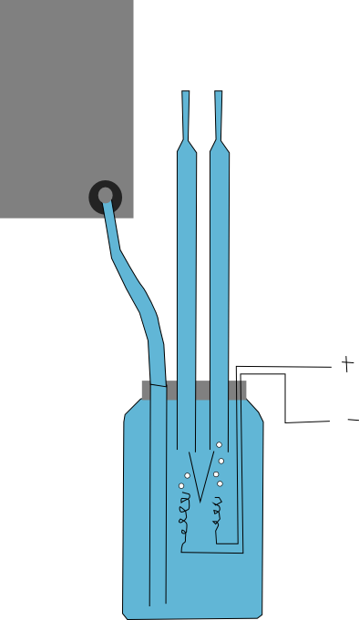

# Electrolysis

**Splitting water into hydrogen and oxygen, and using the recombination of these to launch ping-pong balls.** - Electrolysis in the process of splitting water into hydrogen and oxygen using electricity, and then recombining them explosively! We'll use talking about energy as an excuse to launch a ping pong ball into the air...

Last initially checked on 2025-11-23 by Tara Doherty (ted37@cam.ac.uk) and double-checked on ... by ...

## Tags
<!--- Start Tags (DO NOT REMOVE THIS COMMENT) --->

**Standard** (A standard CHaOS experiment, useable for all hands-on events.)

**Active** (Experiment has working equipment at the time of last update, and is available for events.)

**Chemistry**

**Requires Electricity**
<!--- End Tags (DO NOT REMOVE THIS COMMENT) --->

 

## Equipment Needed 
- **Electricity needed**
- Electrolysis tower (~ 6' tall, white cover, don't drop it - you will need 2 people to move it)
- 0-15V variable power supply OR Power pack of doom
- Small red box (approx. contents): Water models, small air blower, MgSO4, deionised water, funnels etc. power connectors, green trigger button, silencer, ping-pong balls)

 

## Experiment Explanation 

### In a nutshell
Water is split into hydrogen and oxygen, which are then recombined explosively at different concentrations to launch a ping pong ball into the air. This means that you can investigate energy conversion, stoichiometry, what is an explosion, etc. etc..

### Setting up Electrolysis
**Note: Please do not attempt to set up or pack up electrolysis unless you have been shown previously how to do it and are confident you know how (one of the committee members at the event will be happy to show you what needs to be done) - if you get tap water in the electrolysing chamber you will get some very strange results (mainly due to metal oxide formation removing the oxygen as you make it), and the chamber may need to be cleaned.**

1. Ensure the tower is secure, having been tightly roped to a fixed support, and won't fall over.
2. Attach the power cable to the current controller
3. The wires are connected (those with tape on inserted first, and the sparker can have its wires go in any way around, for the electrolysis apparatus itself, connect red and red, and black and black)
4. Ensure that the apparatus is not on wet ground (if outside use separate upside-down trays for the apparatus, and for the power supply and sparker)
5. Use a funnel to pour the MgSO₄ solution into the back chamber (such that it goes to the electrolysis chamber), ensuring that no water enters the sparking chamber
6. Use a gravity siphon (use plastic tubing to suck some water, preferably not with your mouth, to insert the tap water into the front (mixing) chamber, again ensuring no water enters the sparking chamber)

To be safer, you can use deionised water in the front chamber (this is not strictly necessary, but it is a good precaution in case any gets into the electrolysing chamber), however try not to lose too much whilst setting up/packing up so we can reuse it.

### How to run the experiment

1. Double check the tower is secure, having been tightly roped to a fixed support, and won't fall over. There is a sound muffler (the top of a plastic bottle) in the box, that fits over the ignition chamber. It is strongly advised that you use it if you are going to be demonstrating this for any length of time/are indoors.
2. Using the power supply, pass current between the platinum wires in the reaction chamber at the bottom, this splits water into hydrogen and oxygen, which are collected by two inverted burettes. ***Do not use too much voltage for the water splitting, as you may start causing some strange by-reactions.***
3. Holding the mixing chamber valve shut, release hydrogen and oxygen from their burettes in an appropriate ratio into the mixing chamber.
4. Release the mixing chamber valve to let the gas mixture into the explosion chamber, then use the green trigger button to fire it (some off the gas will vent out around the ping pong ball - this is ok). 
5. The electrodes that make the spark are now wet; if you need to repeat the explosion quickly the air blower may be used to dry them more quickly - in practice by the time you've done the introduction again the electrodes may be dry.

<!--- Video set up guide here: (It seems like the image is missing :( )
 --->

### What you need to know about the experiment
Water is H₂O and, if you apply enough energy (needed to break bonds), it can be split into its constituent parts (there should be some models).

You should be able to see that there is twice as much hydrogen as oxygen.

You can get the energy back out rapidly → heat → expansion → acceleration of the ping pong ball.

The sparking electrodes become wet: you've made water! (most of it in vapour form but it condenses on the electrodes and the combustion chamber walls)

If the concentration and ratio is right, the hydrogen/oxygen mixture will **detonate** – a detonation is an explosion which travels at supersonic speeds (you should hear it!)

### Want to know more?
The main point to get across is that water is made out of hydrogen and oxygen and these are gases. But as you go on you can also describe the energy in → energy out aspect, stoichiometry and molecular structure and also relate it to how we would have to make hydrogen for cars.

In starting the explaining at the bottom of the apparatus you can ask what the children can see in the bottle at the bottom. Water and wires. I then go on to say I'm going to put some electricity in the wires, now what can you see? Bubbles. What's in the bubbles?

I then explain how were are turning water into what it's made out of. So what's it made out of? Excellent if they can answer this. Otherwise, do you know another name for water? It's surprising how many kids get H₂O. Why is it called H₂O? Because it's made out of hydrogen and oxygen - "Hydrogen times 2, H₂ and oxygen O."

Once that's settled, you can go for the molecular models. Breaking two water molecules up into two H₂ and one O₂ molecules. While this is in I explain what we're going to do next in recombining the molecules back to H₂O giving them a good shake. Random collisions aren't a bad model for a chemical reaction.

Now is also a good time to talk about the energy in/out business if you're going to. Though for years 6 up really. Energy from electricity is used to split the O and H and is then stored in the O₂ and H₂ molecules. When they recombine the energy is released as heat. Cycling up a hill is the clear analogy, I always like pointing out that as you come down the hill you think that it's "speed for free" but it's not really, you're getting the payback for all the effort you put in cycling up the hill. 

We then try some logic and I turn the power off and draw their attention to the bubbles at the top of the tubes. One is twice the size. Which one is the Hydrogen? Next explain how you're going to mix the gas and arrange your volunteers and check the trigger works.

As you mix the gases you can say, if we need 8 ml of hydrogen, how much oxygen do we need? Then we're pretty much onto the pop. Once that's gone grab the ball quick. With luck there should be some water on the bottom. Show them this, as this is your opportunity to hit home. "Can you see that? You've that made water!" Which is cool.

Parents and teenagers will be interested in the hydrogen cars angle. With this audience I probably would have started with the hydrogen cars. Anyway, you can be a bit environmental pointing out we have to use energy to make hydrogen, and it is only ever an energy store. you can also burn the hydrogen in an internal combustion engine (like at the top) or in the exact reverse of what happens on the electrodes at the bottom, to make electricity right out of the hydrogen and oxygen in a fuel cell, then driving a motor.

 

## Risk Assessment

### **Hazard**: Electrolysis chamber

**Description**: Explosion in the electrolysis chamber (shrapnel injury, hearing damage).

**Affected People**: All

**Before Mitigation**: Likelihood: 4, Severity: 4, Overall: 16 (Unacceptable)

**Mitigation**: Designed so any excess gas vents to the outside, so even if the power is left on there will be no major build-up of gas.
The chamber is made out of a tough plastic (PET) that won't shatter. There is a polycarbonate blast shield in case something does go wrong.

Call first aider in event of injury.

**After Mitigation**: Likelihood: 1, Severity: 4, Overall: 4 (Medium)

 

### **Hazard**: Mixing chamber

**Description**: Explosion in the mixing chamber (shrapnel injury, hearing damage).

**Affected People**: All

**Before Mitigation**: Likelihood: 4, Severity: 4, Overall: 16 (Unacceptable)

**Mitigation**: The valve at the top of the mixing chamber is designed so it defaults to be open, so gas won't build up when you are not paying attention.
The explosion is separated from this chamber by water so it shouldn't ignite. There is a polycarbonate blast shield.

Call first aider in event of injury.

**After Mitigation**: Likelihood: 1, Severity: 4, Overall: 4 (Medium)

 

### **Hazard**: Chlorine

**Description**: Emission of a small amount of chlorine gas is theoretically possible if tap water is put in the electrolysis chamber by mistake.

**Affected People**: All

**Before Mitigation**: Likelihood: 2, Severity: 4, Overall: 8 (High)

**Mitigation**: Only put saturated magnesium sulfate solution into the electrolysing chamber, as these ions will not decompose before the H₂O. As an extra precaution, use deionised water (chloride ions have been removed) instead of tap water everywhere else in the apparatus. Experiment must only be set up and operated by a trained demonstrator familiar with the apparatus and the solutions required.

In the event of an incident, turn off power, remove any casualty from area, call first aider and ventilate the area.

**After Mitigation**: Likelihood: 1, Severity: 4, Overall: 4 (Medium)

 

### **Hazard**: Explosion noise

**Description**: Loud explosion. Possible hearing damage.

**Affected People**: Demonstrator mainly (repeated exposure)

**Before Mitigation**: Likelihood: 4, Severity: 3, Overall: 12 (High)

**Mitigation**: Ignition is by modified kitchen lighter. Is on the end of a long wire, allowing everyone to stand well clear of the explosion (energy dissipates as r². A sound muffler can be attached to the top of the column. Demonstrator should use ear defenders as hearing protection, especially if demonstrating this for a long time.

Use less gas if the explosions are too loud.

Seek GP’s advice in the event of injury.

**After Mitigation**: Likelihood: 2, Severity: 3, Overall: 3 (Low)

 

### **Hazard**: Ping pong ball

**Description**: Being hit by ping pong ball.

**Affected People**: All

**Before Mitigation**: Likelihood: 4, Severity: 2, Overall: 8 (High)

**Mitigation**: Make the explosion chamber quite high, so you can't look in the top. Ball is very light and would not hurt much.

Call first aider in event of injury.

**After Mitigation**: Likelihood: 2, Severity: 2, Overall: 4 (Medium)

 

### **Hazard**: Mains electricity

**Description**: Increased electric shock hazard from mains electricity due to presence of high ionic strength solution (magnesium sulfate solution conducts electricity better).

**Affected People**: All

**Before Mitigation**: Likelihood: 4, Severity: 4, Overall: 16 (Unacceptable)

**Mitigation**: Only low voltage from the power supply can come near the liquids under normal operation. Ensure that apparatus is secure and tightly roped to a fixed support before filling (also prevents risk of tower falling). Do not fill/top up apparatus whilst power unit is nearby. Keep power unit raised above level of base of apparatus.

If solution splashes onto power supply turn off immediately at mains and close experiment.

In case of injury call a first aider (and turn off power if safe to do so).

See electrical parts RA.

**After Mitigation**: Likelihood: 2, Severity: 4, Overall: 8 (High)

 

### **Hazard**: Tower

**Description**: Tower falling

**Affected People**: All

**Before Mitigation**: Likelihood: 4, Severity: 2, Overall: 8 (High)

**Mitigation**: Ensure the tower is stable (i.e. on level ground). Affix to a stable support structure in the venue using bungee cord. Do not allow children to climb/push the tower.

In the event if an injury, call a first aider.

**After Mitigation**: Likelihood: 2, Severity: 2, Overall: 4 (Medium)

 

### **Hazard**: Water models and ropes

**Description**: Trip hazard from balls or ropes being left on the floor.  Risk of children running into inappropriately placed ropes.

**Affected People**: All

**Before Mitigation**: Likelihood: 3, Severity: 3, Overall: 9 (High)

**Mitigation**: Do not leave these "loose" parts of the experiment lying around.

In the event if an injury, call a first aider.

**After Mitigation**: Likelihood: 1, Severity: 3, Overall: 3 (Low)

 

## Risk Assessment Check History 

**Check 1**: 2011-12-22 - Hannah Ford (hf257@cam.ac.uk), **Check 2**: 2012-01-21 - Catherine Collett (chc47@cam.ac.uk)

**Check 1**: 2012-12-16 - Rachel Chapman (rc506@cam.ac.uk), **Check 2**: 2013-01-08 - Ophelia Crawford (oc251@cam.ac.uk)

**Check 1**: 2014-01-23 - Peter Maynes (peter.maynes@cantab.net), **Check 2**: 2014-02-14 - Nunu Tao (nmt26@cam.ac.uk)

**Check 1**: 2014-12-27 - Joseph Hooton (jh795@cam.ac.uk), **Check 2**: 2014-01-02 - Holly Davis (hd308@cam.ac.uk)

**Check 1**: 2015-12-13 - Tim Morgan Boyd (tmb58@cam.ac.uk), **Check 2**: 2015-01-02 - Holly Davis (hd308@cam.ac.uk)

**Check 1**: 2017-01-23 - James Nicholas (james.nicholas@cantab.net), **Check 2**: 2016-01-09 - Haydn James Lloyd (hjl43@cam.ac.uk)

**Check 1**: 2018-01-30 - Jared Jeyaretnam (jaj55@alumni.cam.ac.uk), **Check 2**: 2017-02-09 - Haydn James Lloyd (hjl43@cam.ac.uk)

**Check 1**: 2019-02-05 - Polly Hooton (prh43@cam.ac.uk), **Check 2**: 2019-02-05 - Josh Garfinkel (jlg70@cam.ac.uk)

**Check 1**: 2020-01-18 - Conor Cafolla (ctc43@cam.ac.uk), **Check 2**: 2020-01-20 - Beatrix Huissoon (beh37@cam.ac.uk)

**Check 1**: 2021-01-20 - Conor Cafolla (ctc43@cam.ac.uk), **Check 2**: 2021-01-20 - Polly Hooton (prh43@cam.ac.uk)

**Check 1**: 2022-01-29 - Conor Cafolla (ctc43@cam.ac.uk), **Check 2**: 2022-01-30 - Peter Methley (pm631@cam.ac.uk)

**Check 1**: 2023-01-15 - Peter Methley (pm631@cam.ac.uk), **Check 2**: 2023-01-16 - Jamie Barrett (jb2369@cam.ac.uk)

**Check 1**: 2024-02-14 - Timothy Wong (chw55@cam.ac.uk), **Check 2**: 2024-02-15 - Vlad Penzyev (vp410@cam.ac.uk)

**Check 1**: 2024-12-17 - Andrew Marriott (asm206@cam.ac.uk), **Check 2**: 2024-12-19 - Asmita Niyogi (an637@cam.ac.uk)

**Check 1**: 2025-11-23 - Tara Doherty (ted37@cam.ac.uk), **Check 2**: 

