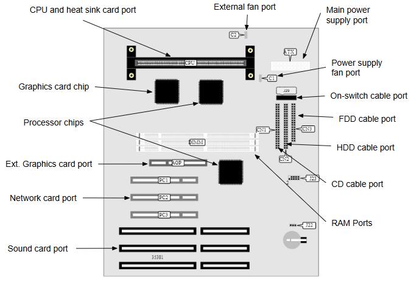

# Computer Dissection 

**Dissecting a computer** - Break open a computer and see how it works inside. 

Last initially checked on 2025-11-25 by Jesse Luo (jl2491@cam.ac.uk) and double-checked on (date) by (name) (email)

## Tags
<!--- Start Tags (DO NOT REMOVE THIS COMMENT) --->

**Standard** (A standard CHaOS experiment, useable for all hands-on events.)

**Computer Science**

**Active** (Experiment has working equipment at the time of last update, and is available for events.)
<!--- End Tags (DO NOT REMOVE THIS COMMENT) --->

 

## Equipment Needed 
- Parts of an old computer, floppy disks, cds, tapes, hard drives.
- Other storage devices (USB sticks, 7" Vinyl Disk)
- Some electrical components, you might be able to see these but they're tiny.
- Induction charger and receiver.
- Dissected plug.
- Dissected Mouse.
- Various earphones/headphones
- Toaster parts (connected chips)
- (Optional) Pen and Paper for explanations / demos

 

## Experiment Explanation 

There are lots of pieces that go into a computer but what do they do?
This can be demonstarted in any order (can start with data storage and then relate to PC parts, or do PC parts first and move on to other storage types and other electronic devices. This diagram helps show how the PC parts connect to each other. You could start with the pieces dissambled and get the kids to help you put things in place, or start with it mostly assembled and separate and show them the different parts (or just talk about it).

When putting the box away, it's easiest to put the DVD drive and floppy drive together (held by elastic band), and separate the other parts into the relevant bags. 

### Data Storage
This is a crucial part of what we do on a computer, what sort of factors might be important? Size controls how much you can store. It might also be important to think about price and data access and transfer times. Flash memory and solid state drives are really quick but expensive. Data is stored as 0s and 1s and each digit is called a bit. These are stored in various ways. Another thing to think about is 'volatility', meaning if the things in memory are preserved when the device is powered off. Also the method of accessing it the data should be considered, the main ways are 'serial' or 'random'.

Hard Drive (HDD)- data stored on disks by magnetic means. Imagine an iron nail, normally it's not magnetic however rub it with a magnet and it becomes magnetic. Rub it again and we can demagnetise it. This stores the data by saying magnetised means 1 and not means 0. The arm swings across the platter and has a tiny magnet to read and write. Many modern drives have multiple platters inside and multiple heads, they're also normally double sided. Data is placed on tracks (concentric circles) broken up into sectors. Part of the drive is reserved for a sector map (Windows File Allocation Table - FAT) to allow the data to be found. Things that can go wrong include a 'head crash' where the read write head gets knocked into the platter and 'thrashing' where the platter spins back and forth to allow the computer to access files at different locations on the same platter. These give random access. 

Flash memory (Solid State) - Used in USB sticks and new solid state drives. They have no moving parts (hence the solid state) so it's ideal for memory sticks. It uses transistors to alter the flow through a gate (very complicated, high charge causes electrons to be fired inducing charges...). It's much smaller and lighter as it doesn't need a moving arm or motor, it's also much faster access and is random like HDD, however is much more expensive. It also has a limited number of write cycles to each memory cell.

Magnetic Tape - This is a much older method of storage which works by storing data on a magnetisable tape. It's very cheap and is still used in medium-large data centres. The main advantage of tape storage is it's very easy to swap tape cartridges into a reader than move HDDs and cheaper than installing connections for all these drives.

CDs - computer bounces a laser off the shiny side to read the data, three layers, plastic, shiny aluminium, see through coating. When it's made a very powerful laser burns 'bumps' into the disk which represent 0s and then copies are pressed. The burned pits scatter the light and unburned areas reflect. To read the laser shines of the disk and only the unburned parts reflect the light fully onto the detector. The spiral along which data is recorded is about 6km, each pit is around 2 millionths of a millionth of a square meter. Many CDs are now writable at home which this process isn't, these have an additional layer of dye before the reflective aluminium layer which can be burned by a slightly more powerful laser than the one used to read, re-writable disks have a metal alloy which phase-shifts between an orderly translucent crystalline form and a random opaque amorphous solid form under the laser. So CD drives need to have the correct laser fitted to do this. CDs hold around 700MB, DVDs have closer pits and so capacity of around 4.7GB. Bluray uses a blue laser which has shorter wavelength so the pits can be even closer bringing capacity to 25GB. HDDVD was a failed alternative to bluray, also using a blue laser, however the disc design meant only 15GB capacity leading it to be abandoned in 2008. 
There's also a mini CD which exploits that CD standard reads from inside to outside (opposite to vinyl). When the standard was set it was decided to go this way for this reason. With vinyl the human drops a needle at the edge whereas cds read outwards until they reach a stop. 

You can talk about how these are also becoming obsolete, why? People want slim and light devices and these don't work with that. Some laptops don't come with USB ports anymore as they're too fat and there's whole ranges of USB C memory sticks and mice for these! 

RAM - This is a volatile type of memory but has very quick access speeds. It pairs a transistor and capacitor and needs constant power to maintain capacitor charge, if not recharged they last milliseconds. 

Floppy Disk - This has a tape like disk and is read like a hard drive. They're very low capacity getting up to 1.44MB. 

SD Cards - These are small rectangular devices, shows how much memory sizes have reduced, the more modern SD card holds 4GB, the same amount as the big, heavy hard drives of this PC.

Price wise tape is around $0.02/GB, HDD $0.033/GB and Flash $0.25/GB from a 2016 survey. RAM costs closer to $3/GB. HDD read/write speed is around 120MB/sec and Flash 525MB/sec, RAM can be 6-17GB/sec (note G not M)
Talking about data transfer big companies like Google which need to transfer vast quantities of data often use hard drives shipped in trucks. Amazon snowmobile can transfer 100 Petabytes of data from your location to the amazon cloud in a week, versus gigabit internet (1gbps) which is very fast home internet taking 20 years.

This computer has two hard drives a 3.2GB one (western digital Caviar 13200) and a 4.3Gb one (Quantum Fireball SE). Many modern PCs come with 1TB hard drives and or 256GB solid state. For phones the iPhone x has 64-256GB. Storage devices are decreasing in size.

NB - Vinyl - Some people may think of this as a method of storing data, and yes it is! However it's not one commonly used by computers as it's very specialised to sound data. To play them back one runs a needle over the record, in mono vinyl this moves up and down depending on how deep the groove is (analogue storage, rather than digital, and read-only). Using a transducer (magnets to induce a current from these vibrations) it induces an electrical signal, this is passed to the speaker which vibrates in this pattern. When doing the etching we use a different transducer to turn the sound into an electrical signal which gets etched onto the disk. Stereo vinyl uses a clever trick to work on old mono players. It encodes the sum of left and right signals in vertical vibrations and use lateral vibrations to encode the difference. A mono player just picks up the sum but any stereo player can do the maths to separate left and right.
There's also some great examples of data issues with vinyl, records come mainly in 7" and 12" (but sometimes also 10"). The bigger diameter gives more space for grooves, allowing longer tracks to be stored on them. They also come in different rpms, mainly 33 1/3 or 45 (but also 78). The faster the rpm, the less can be fit on the disk as it travels through the groove faster, however the quality is better as the details of the vibrations have more space to be stored. 

### Computer parts

CPU (Central Processing Unit) - This sends signals and controls other parts of the computer. We often compare clock rates, the CPU completes one basic task in a tick of the clock. Overclocking increases the number of ticks a second, it's designed that computers can easily complete most tasks within a tick, so decreasing the time shouldn't cause most tasks to fail. The computer in front has 200MHz clock speed (I think), a modern intel i7-3970X (very good 2018 CPU) has a 3.5GHz clock speed and iPhone X has 2.39GHz.

We could demonstrate pipelining using a quick demo. Get some pieces of paper and some pens and get the children to line up in an 'assembly line'. Each child is responsible for drawing one stroke of e.g. a square which takes 4 children to be drawn. Without pipelining, allow the kids to start producing squares but the first child must wait for the entire square to be completed before they can start on the next one. With pipelining, the first child can continuously grab paper and draw the first stroke without waiting for the rest. Can then talk about how this increases throughput, the need for buffers and latches to balance producer/consumer inconsistencies, e.t.c.

Fans - These cool down the components, they're an active cooling method as they require power. This computer had several plastic pieces to control where the fans cooled. Other active cooling methods include water cooling (and other fluids) which is more common in high end gaming PCs and commercial data centres and servers. With water their is added risk as water and computers don't mix well! However water is better at transporting heat than air. There is a red ended cable labelled 'F' which goes from the red pins on the motherboard to the fan and controls it's speed and provides power.
The power supply has a built in fan, which connects to port J18 on the motherboard.

Passive Cooling (Heat sinks) - You can spot one on the CPU, it's noticeably cold to the touch, this is as it's designed to transfer heat well. Note the large surface area to transfer heat.

CD drive - this reads the CD, you can see the laser which reads the cd and the motor which spins the CD. It can spin 200-500rpm however some modern drives can read at higher speeds so spin even faster. This can be opened up to show the DVD tray, how it spins and the laser reader inside.

Floppy drive - not very common anymore! This works like a HDD (read and write head for portability) but the floppys are insertable. Taking this apart shows the elasticated eject mechanism (works even without popwer) and the read/write arm.

Network card with ethernet port (old computers didn't have wireless!) - this processes data to be ready to send over a network. This is often using packets and we can do a quick demo to talk about these. We split the message into lots of individual 'packets' these are numbered and thrown between children until they land in the incoming box, some might miss and the network card will have to make a new copy and resend. The card sorts the data to be back in order, deals with any missing packets and the like. In here there is a Realtek GTS FC-515LS, there is an external antenna from a different computer to allow WiFi connectivity. 

Sound card - Does really what it says, converts signals from the CPU into a form that can be sent on, encoding it into various formats and outputting it. Also deals with things like microphones etc (the aux port inputs and outputs can be seen on the side). The sound card in here is a HP Soundblaster 16. You'll notice a cable labelled 'A' (for Audio) which is attached to this card, it goes to the CD drive.

Video card / Graphic Card - Basically sound card but for video, many modern ones have a GPU (Graphical Processing Unit), this is a really specialised processing unit designed for computations to do with displaying images. They're also sometimes used for mining bitcoins as they do better than standard CPUs for these calculations. This computer has a Trio 64V2 which is on the motherboard (see diagram) and no external card (but there is a AGP port to add one for better performance), these became more common with the rise of video games. Could try and explain how a GPU tries to maximise throughput (number of tasks finished per second, processing in parallel) whereas a CPU tries to minimise latency (time taken to complete one task from start to finish, processing in series)
 
Power supply - This is the unit with a standard IEC lead input and lots of cabling coming out. DON'T PLUG IT INTO THE MAINS. This supplies power to all the different parts, you'll see they're all labelled Px and if you look at other bits you can see some black tape which indicates there's a power lead going there. For instance P1 goes to the motherboard. You'll notice it has it's own internal fan to keep cool. 

Data Cables - You'll see these ribbon cables which transfer data to and from the CPU, there's three here labelled D1, D2 and D3. D1 goes to the CD drive, D2 goes through the 2 HDD drives (a second was fitted later to this computer) and D3 goes to the floppy drive. These connect to ports CN1-3 on the motherboard

Motherboard - On this PC it's a HP Brio 83xx board. Here's a picture of a motherboard to help identify some pieces. 

There are lots of parts to point out and too many to list immediately. You can probably also pick out some capacitors and conductors which there are examples of in the electronics components bag.

On switch - There's a cable (with circular iron piece on it) running from the one switch and LEDs to a set of pins on the motherboard near where the data cables plug in (port J29). 

Modem (not present) - This stands for MODulator/DEModulator and comes from how people originally connected to the internet over telephone lines. Adults may remember the dial tones it made, this early internet connection was dial-up, transfer speeds where around 56kbit/s. It converts digital signal into analogue for transmitting over the telephone lines. (I'm not sure if I have a modem still lying around so if you have one let me know) Modern modems use cable and sattelite to connect and are often combined into a single unit (called a 'gateway') with a router.

Router (not present) - This allows multiple devices to connect to a LAN (local area network), you may encounter LAN games on consoles which don't require you to be connected to the internet and to link the consoles via Ethernet. Often these are combined with modems to form a 'gateway'.

Gateway (not present) - Modern combination of a 'modem' and a 'router' allowing multiple devices to connect to the internet often using wireless signals, WiFi.

### Other Electronic Components

Cabling - There's quite a few cables people might be familiar with included inside, you can ask if they know what they're for and why we might have different types of cable. One thing to think about is what is being sent via the cable. Speakers require analogue signals whereas other things require digital. You also need to consider how far a signal can propagate down a cable, USB has a limit of around 5 metres, that's why you don't get really long USB cables. USB also (traditionally, this is changing with USB C which is less strict on master/slave and supplies more power) has a master and peripheral set up which is why cables always have a non-USB end (which connects to the peripheral). These peripheral devices can't communicate with each other without going through the master and there is a hard limit of 127 peripherals. Cables also have a bandwidth, USB is 5Gbit/s and HDMI is 8.16Gbit/s, even this isn't enough bandwidth for a 5k/60fps screen like on a new iMac. 
Some devices when connected also need power to be supplied, USB doesn't standardly provide a lot of power. for example, if you plug a phone into a computer you'll probably notice a slow charge however you may notice modern computers may come with charging ports which supply a non-standard amount of amps to charge devices faster. Ethernet is great for long distances, it's easily boosted for even longer distances and can be switched via routers to form large networks. 

Wireless Charging - This was a big thing for phones a few years ago and then people moved on to rapid charging and other things when people realised it was a bit rubbish then. Some phones still have it however there was lots of cheap Chinese charging pads and even fitting kits which is what we have here. 
The technology is developing and more modern phones have the capability to receive it (though not through thick or metal phone cases).
If they've seen the electromagnetism experiment they should be familiar with this! Essentially in the charging pad (the top swivels to reveal the insides) you can see the coil and piece of metal this creates a magnetic field when plugged in (don't plug it in though). There's then a thin piece of plastic which I've peeled open which has a coil, magnet induces current in coil, this charges the phone. The major downsides of this are, it's not very efficient and everything gets very very hot (slightly broken the receiver when dismantling it, if you desired to fix it solder the other end of the coil to AC2).

Plug - This is an old and broken USB plug. You can see how the wires go in the inside. There's a plastic prong, this prong is usually an earth prong. In the UK plugs need to have these as most sockets require something to be plugged in here before opening the other holes (that's why it's slightly longer). Double insulated devices don't need the earth connection. In EU and US plugs there are earth connectors at the top and bottom, you find plugs that need earth are more circular so the can reach them, however those that don't are quite linear.

Toaster parts - Shows that electronic circuits are present in lots of everyday items. It has resistors, capacitors, chips, LEDs and switches that can be pointed out (there's push-to-make buttons that say bagel and defrost).. There's also a relay to provide elctrical isolation (prevent electrocutions etc).

Mouse parts - Relatively simple circuit designed to send button presses and movement sensor data back to a USB compatible devices. This one is wired-modern ones are often wireless and require charging or battery replacement, but can be more convenient to use. You can demonstrate how clicking the buttons triggers the switches on the circuit board.

Audio equipment - The box also contains several types of earphones and a set of headphones, as well as converters between aux ports and quarter inch jacks, airplane outputs and dual aux ports (audio splitter). It also has a USB MP3 player. These show the cross-compatibilty of audio devices and the variety of parts needed to facilitate it. Modern systems tend to be simpler, so less converters are required (for examples modern airplanes tend to have aux ports now). Also, wireless headphones working via bluetooth have become much more common. This has benefits for convenience and portability, but requires charging, can affect the audio quality and can be easier to lose. They also won't be compatible with older devices (not all speakers or car radios have bluetooth capabilities).

Drone - The flap on the underside opens up to show the underside of the circuit board. Can't see much beyond the connecting wires, but could talk about powering motors to lift up the drone. Again demonstrates the use of electronics in most things people see in everyday life. 

Printer cartridge - Not sure why this is in here, but could talk about how computers can send stuff to printers, via wired or wireless and translate that into printing on paper.

 

## Risk Assessment

### **Hazard**: There may be residual electrical charge in some components.

**Description**: Electric shock

**Affected People**: All

**Before Mitigation**: Likelihood: 2, Severity: 3, Overall: 6 (medium)

**Mitigation**: Never plug anything in

**After Mitigation**: Likelihood: 1, Severity: 3, Overall: 3 (low)

 

### **Hazard**: Sharp bits

**Description**: Getting stabbed / cut with computer parts

**Affected People**: All

**Before Mitigation**: Likelihood: 3, Severity: 4, Overall: 12 (high)

**Mitigation**: Keep track of all the bits, don't let people run off with them. Visually inspect components for sharp points/edges and avoid demonstrating with them. If children are being silly take bits off them. 

**After Mitigation**: Likelihood: 1, Severity: 4, Overall: 4 (medium)

 

### **Hazard**: Small bits

**Description**: Potential for swallowing / choking on small parts

**Affected People**: All

**Before Mitigation**: Likelihood: 3, Severity: 5, Overall: 15 (unacceptable)

**Mitigation**: Keep track of all the bits, don't let people run off with them. If children are being silly take bits off them.  Don't let kids put them near their mouths. It could be easier to manage if you keep the box of all components under your table and take out a couple at a time as you are demonstrating, rather than laying everything out on the table and being overwhelmed.

Call a first aider if choking occurs.

**After Mitigation**: Likelihood: 1, Severity: 5, Overall: 5 (medium)

 

### **Hazard**: Falling bits

**Description**: Heavier parts e.g. power supply could get knocked off table and bump into someone / hit someones foot

**Affected People**: All

**Before Mitigation**: Likelihood: 3, Severity: 3, Overall: 9 (high)

**Mitigation**: Don't put parts near the edge of tables and make sure they are securely on the table. Maybe heavier components should just stay on the floor. It could be easier to manage if you keep the box of all components under your table and take out a couple at a time as you are demonstrating, rather than laying everything out on the table and being overwhelmed.

**After Mitigation**: Likelihood: 1, Severity: 3, Overall: 3 (low)

 

### **Hazard**: Drone

**Description**: Fingers being caught in the drone wings

**Affected People**: All

**Before Mitigation**: Likelihood: 3, Severity: 3, Overall: 9 (high)

**Mitigation**: Do not connect a power source, try to get people to hold it one at a time. Keep an eye out for children trying to spin the wings with their fingers

**After Mitigation**: Likelihood: 1, Severity: 3, Overall: 3 (low)

 

## Risk Assessment Check History 

**Check 1**: 2018-10-02 - Thomas Webster (tw432@alumni.cam.ac.uk), **Check 2**: 2018-12-12 - Matthew Le Maitre (msl54@cam.ac.uk)

**Check 1**: 2019-12-26 - Thomas Webster (tw432@alumni.cam.ac.uk), **Check 2**: 2020-01-27 - Polly Hooton (prh43@cam.ac.uk)

**Check 1**: 2021-01-22 - Conor Cafolla (ctc43@cam.ac.uk), **Check 2**: 2021-01-22 - Polly Hooton (prh43@cam.ac.uk)

**Check 1**: 2022-02-01 - Andrew Sellek (ads79@cam.ac.uk), **Check 2**: 2022-02-09 - Margaret Johncock (mllyj2@cam.ac.uk)

**Check 1**: 2023-02-17 - Emma Crickmore (elc75@cam.ac.uk), **Check 2**: 2023-02-18 - Asmita Niyogi (an637@cam.ac.uk)

**Check 1**: 2024-02-15 - Peter Methley (pm631@cam.ac.uk), **Check 2**: 2024-02-15 - Isobel Gilham (ig419@cam.ac.uk)

**Check 1**: 2025-01-31 - Rowan Ong (rzmo2@cantab.ac.uk), **Check 2**: 2025-02-08 - Asmita Niyogi (an637@cam.ac.uk)

**Check 1**: 2025-11-25 - Jesse Luo (jl2491@cam.ac.uk), **Check 2**: 

