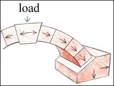

# Arch Bridge

**Building an arch bridge, and then walking over it.** - Can you build a bridge strong enough to walk on?

Last initially checked on 2023-01-14 by Jamie Barrett (jb2369@cam.ac.uk) and double-checked on 2022-01-14 by Johan Kidger (jpk51@cam.ac.uk)
## Tags
<!--- Start Tags (DO NOT REMOVE THIS COMMENT) --->

**Standard** (A standard CHaOS experiment, useable for all hands-on events.)

**Engineering**

**Active** (Experiment has working equipment at the time of last update, and is available for events.)
<!--- End Tags (DO NOT REMOVE THIS COMMENT) --->

 

## Equipment Needed 
- **This experiment can take place outdoors**
- Bridge Base (flat board and two triangular pieces, they attach together with wing nuts)
- 5 Blocks (all the same)
- 2 wooden supports (scaffolding to assist the building process) - MISSING SINCE 2019

 

## Experiment Explanation 

### **Overview**:

This is an arch bridge built of 5 identical blocks, which the children can then walk over.

Possible activities:
1. Build bridge.
2. Walk over it.

Other things to talk about:
Forces on blocks.

Tips for demonstrating:
The blocks are quite heavy for small children, so you may need to lift them for them/get parents to help. Don't let them jump on the bridge/too many on at once - jumping off sideways may cause the bridge to fall to the side, too many children on at once may push each other off.

### **Basic procedure and explanation**:

To build the arch bridge, get the children to place the wooden supports between the ends of the bridge (say there like the scaffolding used around the edge of buildings or under bridges), then get them to add the blocks, starting at the ends. If they have trouble working out which way round to put the blocks try showing them the trapezium shaped side of the block. Ask them whether the longer or shorter side needs to go on top to make the arch shape.

Check that the blocks are all lined up straight and that the tops of the blocks all meet. Ask them what will happen when you take the wood away - will the bridge stay up? Why?

Take the wood away - the bridge stays up! Talk about how the shape of the brick means that they are being squashed in from the sides ('in compression') and they can't fall down. Ask if they think the bridge is strong enough for them to walk over (subtly check that the bridge is sturdy first) - take care that they don't fall when they do this.

When the child is standing on the middle of the bridge, ask them what is stopping them from going straight down. Depending on the child's age, could talk about the force of their weight, and explain how it is pushed out sideways and that it is because the ends of the bridge cannot move away from one another that they don't fall down.

Explain that this is how real arch bridges work - the mortar 'gluing' the bricks together isn't very important, all the strength is due to the bricks being squashed together horizontally. Bricks are strong in compression, but no good in tension.

It can be useful to ask the children how the other blocks would have to move to allow one of the blocks to fall, to get them to see the arch as a lot of wedges jammed in between the piers. Very wide stone arches have a tendency to force apart their piers and collapse.

 

## Risk Assessment

### **Hazard**: Blocks

**Description**: May fall on feet and injure people.

**Affected People**: All

**Before Mitigation**: Likelihood: 4, Severity: 2, Overall: 8

**Mitigation**: Blocks are designed to be fairly light and covered with rubber. Demonstrators may need to help younger children carry the blocks. When taking apart ensure feet are sufficiently far back.

Call a first aider in the case of an injury.

**After Mitigation**: Likelihood: 2, Severity: 2, Overall: 4

 

### **Hazard**: Bridge Collapse

**Description**: Bridge may collapse due to instability. Blocks may become smooth over time and slip against each other causing bridge collapse. Could result in people falling off bridge or being hit by falling blocks.

**Affected People**: All

**Before Mitigation**: Likelihood: 3, Severity: 3, Overall: 9

**Mitigation**: Demonstrators should test the bridge by walking over it before any children do. Children should not be allowed to jump off the bridge sideways, as this may cause the bridge to fall. Blocks should be checked for smoothness at the beginning of the event. Demonstrator should remain vigilant for blocks slipping during the event.

Demonstrator must stop experiment if they suspect that the blocks are getting smooth.

Call first aider in the event of injury.

**After Mitigation**: Likelihood: 2, Severity: 3, Overall: 6

 

### **Hazard**: Blocks

**Description**: May trap fingers between blocks during construction.

**Affected People**: All

**Before Mitigation**: Likelihood: 3, Severity: 2, Overall: 6

**Mitigation**: Demonstrators may wish to help small humans when placing the blocks. Mention that it is better to hold them across their sides rather than ends.

Call a first aider in the event of an emergency.

**After Mitigation**: Likelihood: 2, Severity: 2, Overall: 4

 

### **Hazard**: Blocks

**Description**: Being hit by carried blocks.

**Affected people**: All 

**Before Mitigation**: Likelihood: 2, Severity: 3, Overall: 6

**Mitigation**: Small or overexcited children should be supervised when moving blocks. Demonstrator should volunteer to do it themselves.

Call first aider in event of injury.

**After Mitigation**: Likelihood: 1, Severity: 3, Overall: 3

 

### **Hazard**: Built bridge

**Description**: Children/demonstrator falling off the bridge.

**Affected People**: All

**Before Mitigation**: Likelihood: 3, Severity: 3, Overall: 9

**Mitigation**: Make sure that the bridge is erected somewhere the floor is flat, with no sharp corners or objects to fall on. Don't let kids jump up and down on the bridge (both because the blocks can slip and the child can fall off). Children should only go on the bridge one at a time. Don't let children crawl under the bridge. Demonstrator to check the bridge is stable before allowing children to stand on it.

Call first aider in the event of an accident.

**After Mitigation**: Likelihood: 2, Severity: 3, Overall: 6

 

## Risk Assessment Check History 

**Check 1**: 2011-01-22 - Anna Kalorkoti (anna.kalorkoti@cantab.net), **Check 2**: 2012-01-14 - Aaron Barker (arb78@cam.ac.uk)

**Check 1**: 2012-01-14 - Aaron Barker (arb78@cam.ac.uk), **Check 2**: 2012-01-26 - Rosy Ansell (rosemary.a.r.hunt@gmail.com)

**Check 1**: 2013-01-08 - Ophelia Crawford (oc251@cam.ac.uk), **Check 2**: 2013-01-20 - Richard Hall (rjh216@cam.ac.uk)

**Check 1**: 2014-01-18 - Benjamin Lai (bl337@cam.ac.uk), **Check 2**: 2014-01-22 - Brett Abram (ba305@cam.ac.uk)

**Check 1**: 2015-02-01 - Benjamin Lai (bl337@cam.ac.uk), **Check 2**: 2015-02-11 - Sarah Wiseman (sw628@cam.ac.uk)

**Check 1**: 2015-12-16 - Robert Gayer (rg478@cam.ac.uk), **Check 2**: 2015-12-27 - Andrei Ruskuc (ar720@cam.ac.uk)

**Check 1**: 2017-01-22 - Robert Gayer (rg478@cam.ac.uk), **Check 2**: 2017-02-01 - Joanna Tumelty (jt574@cam.ac.uk)

**Check 1**: 2018-01-07 - Joanna Tumelty (jt574@cam.ac.uk), **Check 2**: 2018-01-12 - Josh Garfinkel (jlg70@cam.ac.uk)

**Check 1**: 2019-01-20 - Yaron Bernstein (yb258@cam.ac.uk), **Check 2**: 2019-01-30 - Conor Cafolla (ctc43@cam.ac.uk)

**Check 1**: 2020-01-03 - Oliver John (oaj24@cam.ac.uk), **Check 2**: 2020-01-20 - Beatrix Huissoon (beh37@cam.ac.uk)

**Check 1**: 2020-12-27 - Esmae Jemima Woods (ejw89@cam.ac.uk), **Check 2**: 2020-01-17 - Andrew Sellek (ads79@cam.ac.uk)

**Check 1**: 2022-02-01 - Andrew Sellek (ads79@cam.ac.uk), **Check 2**: 2021-01-17 - Andrew Sellek (ads79@cam.ac.uk)

**Check 1**: 2023-01-14 - Jamie Barrett (jb2369@cam.ac.uk), **Check 2**: 2023-01-14 - Johan Kidger (jpk51@cam.ac.uk)
