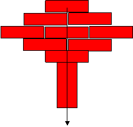
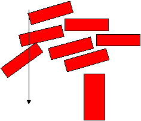
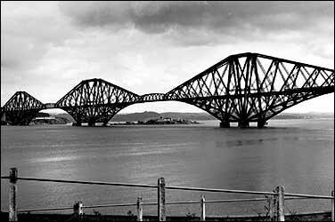
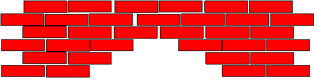
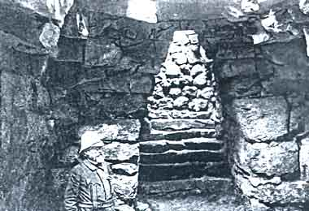

# Cantilever Bridges

**Building a series of cantilever bridges** - Can you build bridges across wider and wider rivers?

Last initially checked on 2025-11-23 by Evelyn Bassett (ejb228@cam.ac.uk) and double-checked on 2025-11-23 by Chiara Delpiano-Cordeiro (cd796@cam.ac.uk).

## Tags
<!--- Start Tags (DO NOT REMOVE THIS COMMENT) --->

**Standard** (A standard CHaOS experiment, useable for all hands-on events.)

**Engineering**

**Active** (Experiment has working equipment at the time of last update, and is available for events.)
<!--- End Tags (DO NOT REMOVE THIS COMMENT) --->

 

## Equipment Needed 
- **This experiment can take place outdoors**
- Base boards
- Small blue box of wooden blocks
- Laminated photos

 

## Experiment Explanation 

Basically you want to get across that you have to balance everything, and if the centre of balance goes over the edge of any support it will fall over.

Setting up the experiment:
--------------------------

Kids: works best on the floor, as the blocks don't fall too far when stacks topple! Get everyone to sit on the floor around the board/ pile of bricks
Grown ups: we've run this at an adults-only science evening, on a table, which worked fine. But adults are much less confident about stacking blocks than kids are!

The challenge:
--------------

The challenge is to build three bridges across the river. There are two rules...
1) You're only allowed to use the wooden blocks
2) The wooden blocks can only stand on the support blocks, not on the land (it's marshland, too soggy!) or in the river (cheating!)

### The first bridge (smallest gap)

Start with this one, as everyone can do it! The first gap is easy, as you can just put a block across it. 

Extension: Why does the block not fall into the river? One answer is that the block is being pulled down (by gravity), but is being pushed up the same amount by the supports at each end. This balance (of forces) is why it stays still.

### The second bridge (bigger gap)

Do this one next, once they've succeeded at the first bridge. This gap is the width of three bricks. If you hold a brick partially across the gap/on the end of the support and let it go, it falls- why? (The brick/the forces acting on the brick aren't balanced.) How can you balance the blocks? (Think of a see-saw.) How can you get more of the block to go across the gap? (Balance it on the other side). 

Try to do this yourself before you demonstrate the experiment. The most obvious design uses 8 blocks (2 towers of 1;2;1), the fewest we've see it done in is 5, but this doesn't look much like any bridge we've ever seen! It's not as stable - why?

Look for mirror lines/symmetry: this is a simple way of making sure the towers are balanced. For the most common 8 block design the two towers are symmetrical, and each tower is symmetrical in the line above the support/ along the middle layer of bricks. (This is also true of the most common version of the third bridge). 

It can be a bit of a surprise to find out how much of this is not obvious to some children. Many will start trying to build something like an arch, or want to put supports in the river. The first thing is to get them to see that combining bits of structure that tip over in opposite directions can produce something that balances. 

The real trick is knowing how long to let them try to build the bridge without telling them how to do it. It's much better if they figure it out for themselves, but you want them to be able to build the bridges even if they can't spot the balancing trick! You want to give them a clue *just before* they get bored of trying - the real pro demonstrators can do this without being obvious that it's a clue, but that takes practice!

Once you've got to the end of this second bridge don't forget to tell them "well done" for completing a tricky challenge!

Here's an alternative version of our explanation for engineers/those used to thinking about moments:
The second bridge requires you to start cantilevering. Get the kids to show you where they want to put the next block - and why it won't work - suggest that they need to counterbalance it with weight - another block. Making the smallest bridge from 2 balancing blocks can help to get them started on the others. Then get them to see that things further from the fulcrum have more tipping power (moment). You can demo this with the bricks, using one as a fulcrum another as a beam and more as weights. Or get them to hold the heavy mass from the spinny chair (another CHaOS experiment that may be nearby...) close to them, then at arms length. Comparison with see-saws might be useful, as most children should have played on one of these).

### The third bridge (biggest gap)

This builds on the ideas in the second bridge - take how long that took as an indication for how quickly to go through this. If they really struggled on the second bridge you don't have to make them do this one themselves. Get them to help you do this one, as you can't hold all the blocks yourself (which is usually true - two pairs of hands makes it much easier!)

You can use the same idea as the bridge above to go across a bigger gap, but this time the towers need to be wider (which ends up making them taller if you pick the simplest design). The most obvious solution is 2 towers of 9 blocks (1;2;3;2;1), but we've seen it done in as few as 7 blocks. What's the smallest number you can build it in? (We're mainly aiming that challenge at you demonstrators, but you might also want to give it to kids that have figured out the first challenge quickly!)

Extension: If you add more blocks to the top, to look something like the Corbeled arch below, the bridge appears to be more stable. Why is that?

For engineers: The third gap is more difficult, with the number of blocks you have, you can't just pile up a counterweight near the fulcrum, you have to get some of it further out to counterbalance the bridge.

 These bridges exist in reality!
--------------------------------

**Note: some of the pictures in the box are arch bridges that go with the arch bridge experiment (which doesn't have its own box). Try not to confuse the two - the forces aren't the same in each.**

You can compare the bridge to the Forth Bridge: a real example of a cantilever bridge. There are photos in the box. This bridge is in Scotland, and is famous for being so long that by the time you've finished painting one end that you need to go and start painting the other end again!

Look for the picture of the bridge in construction - here you can see the cores of the towers before sections were added to each side. That's analogous to our supports before we add sideways with extra blocks.

Two questions that seem to come up quite often with the bridge photos:
Why isn't it solid like the blocks? The Forth Bridge is made out of metal, this behaves differently to wood, and if you can fix the pieces of metal together you can get away with less metal than something completely solid. Apart from anything else, that saves money on metal!
Is our bridge weaker than real ones? Yes, because the blocks aren't joined. But it's very solid considering!

A primitive form of arch was called the Corbeled arch, this is basically two of the balanced cantilevers next to each other with the wall acting as the counterweight.

This was used in passages and tombs, before the true arch was developed.

 

## Risk Assessment

### **Hazard**: Tower of blocks

**Description**: A very tall tower may mean bricks have enough energy to bruise when the tower falls down.

**Affected People**: All (especially children)

**Before Mitigation**: Likelihood: 3, Severity: 2, Overall: 6 (Medium)

**Mitigation**: Demonstrator to monitor building, anticipate collapse, and get children to stand back. Demonstrator should prevent children from building excessively tall towers. 

Call a first aider in the event of injury.

**After Mitigation**: Likelihood: 2, Severity: 2, Overall: 4 (Medium)

 

### **Hazard**: Board/ Blocks on floor

**Description**: There is a trip hazard from the board or blocks placed on the floor.

**Affected People**: All

**Before Mitigation**: Likelihood: 4, Severity: 2, Overall: 8 (High)

**Mitigation**: Don't put the experiment in an area which is likely to be used as a thoroughfare.

Call first aider in the event of injury.

**After Mitigation**: Likelihood: 2, Severity: 2, Overall: 4 (Medium)

 

### **Hazard**: Gaps between boards

**Description**: Children may pinch their fingers in between the boards on the floor.

**Affected People**: All (especially children)

**Before Mitigation**: Likelihood: 2, Severity: 2, Overall: 4 (Medium)

**Mitigation**: Demonstrator to ask children to not place their fingers where they can be pinched between the boards. Tape gaps between boards and boards and floor.

Call first aider in the event of injury.

**After Mitigation**: Likelihood: 1, Severity: 2, Overall: 2 (Low)

 

### **Hazard**: Blocks

**Description**: Possible splinters from the wooden blocks.

**Affected People**: All

**Before Mitigation**: Likelihood: 2, Severity: 3, Overall: 6 (Medium)

**Mitigation**: Demonstrator to make sure only wooden blocks with no splinters coming out are used. Report any blocks that aren’t smooth/sand them smooth.

Call first aider in the event of injury.

**After Mitigation**: Likelihood: 1, Severity: 3, Overall: 3 (Low)

 

## Risk Assessment Check History 

**Check 1**: 2012-01-14 - Aaron Barker (arb78@cam.ac.uk), **Check 2**: 2012-01-26 - Rosy Ansell (rosemary.a.r.hunt@gmail.com)

**Check 1**: 2013-01-08 - Ophelia Crawford (oc251@cam.ac.uk), **Check 2**: 2013-01-20 - Richard Hall (rjh216@cam.ac.uk)

**Check 1**: 2014-01-18 - Benjamin Lai (bl337@cam.ac.uk), **Check 2**: 2014-01-22 - Brett Abram (ba305@cam.ac.uk)

**Check 1**: 2015-02-01 - Benjamin Lai (bl337@cam.ac.uk), **Check 2**: 2015-02-11 - Sarah Wiseman (sw628@cam.ac.uk)

**Check 1**: 2015-12-16 - Robert Gayer (rg478@cam.ac.uk), **Check 2**: 2015-12-27 - Andrei Ruskuc (ar720@cam.ac.uk)

**Check 1**: 2017-01-22 - Robert Gayer (rg478@cam.ac.uk), **Check 2**: 2017-01-02 - Matthew Le Maitre (msl54@cam.ac.uk)

**Check 1**: 2018-01-07 - Joanna Tumelty (jt574@cam.ac.uk), **Check 2**: 2018-01-12 - Josh Garfinkel (jlg70@cam.ac.uk)

**Check 1**: 2019-01-08 - Thomas Webster (tw432@alumni.cam.ac.uk), **Check 2**: 2019-01-20 - Yaron Bernstein (yb258@cam.ac.uk)

**Check 1**: 2020-01-10 - Esmae Jemima Woods (ejw89@cam.ac.uk), **Check 2**: 2020-01-24 - Beatrix Huissoon (beh37@cam.ac.uk)

**Check 1**: 2021-01-21 - Polly Hooton (prh43@cam.ac.uk), **Check 2**: 2021-01-22 - Andrew Sellek (ads79@cam.ac.uk)

**Check 1**: 2022-02-01 - Polly Hooton (prh43@cam.ac.uk), **Check 2**: 2022-02-04 - Lauren Mason (llm34@cam.ac.uk)

**Check 1**: 2023-01-14 - Jamie Barrett (jb2369@cam.ac.uk), **Check 2**: 2023-01-14 - Johan Kidger (jpk51@cam.ac.uk)

**Check 1**: 2024-01-09 - Jessica Trevelyan (jet81@cam.ac.uk), **Check 2**: 2024-01-24 - Lauren Mason (llm34@cam.ac.uk)

**Check 1**: 2024-12-17 - Anna Ritschl Ebell (ar2182@cam.ac.uk), **Check 2**: 2024-12-18 - Chiara Delpiano Cordeiro (cd796@cam.ac.uk)

**Check 1**: 2025-11-23 - Evelyn Bassett (ejb228@cam.ac.uk), **Check 2**: 2025-11-23 - Chiara Delpiano Cordeiro (cd796@cam.ac.uk)

