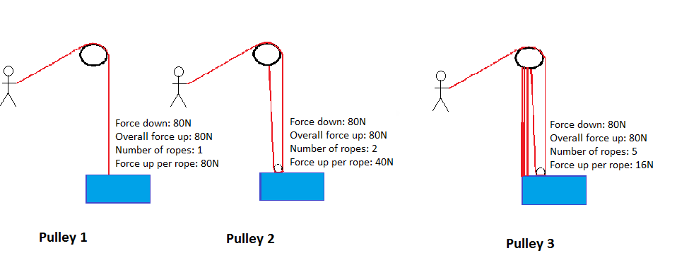
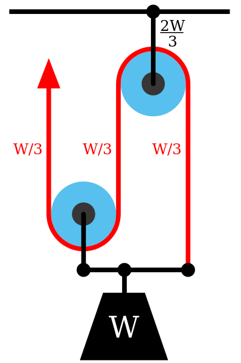
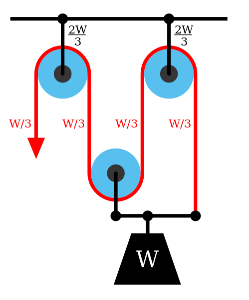

# Mechanical Advantage

**Using pulleys and levers to explore mechanical advantage** - Check out this huge tripod with weights and pulleys, then try using pulleys and levers to explore the idea of "mechanical advantage"

Last initially checked on 2024-12-21 by Anna Ritschl Ebell (ar2182@cam.ac.uk) and double-checked on 2025-01-11 by  (jet81@cam.ac.uk).

## Tags
<!--- Start Tags (DO NOT REMOVE THIS COMMENT) --->

**Standard** (A standard CHaOS experiment, useable for all hands-on events.)

**Engineering**

**Active** (Experiment has working equipment at the time of last update, and is available for events.)
<!--- End Tags (DO NOT REMOVE THIS COMMENT) --->

 

## Equipment Needed 
- **This experiment can take place outdoors**
- Tripod
- Various pulleys
- Water weights in bag

 

## Experiment Explanation 

Here is a hopefully not too ropey write-up of what is an awesome experiment (I hope you won’t string me up with all these puns)! You start with the contraption up and the bag containing 4 filled 2 litre water bottles out loose.

(NB: At the moment there are currently only 3 bottles)

**The bag**

First, get the kids try and lift the bag, and then like a Christmas turkey get them to guess the weight. Wild guesses will ensue. Tell them there are 4x2L bottles in the bag. Ask them how heavy 1L of water is. (Wild guesses). Tell them that 1kg = 1L of water. Then get them to tell you how heavy the bag is (4x2=8 is surprisingly difficult). 8kg of weight is how heavy the bag is (or 80N downwards), so how much force do you need to apply to lift it slowly? Just over 8kg worth of weight (or 80N). I think we have bagged that idea, let’s move on. Maybe say that as far as you pull down, the bag lifts up, as it maybe is useful to say that at this point so they are thinking of it…

**First Pulley**

Put it on to the pulley that looks like the first picture in figure 1 (I know the diagram isn’t great, but I am not artistic and was using paint). Ask them how much weight is pulling down (8kg/80N), then ask how much force you need to lift it up (just over 8kg/80N), then ask how much one rope must pull up to lift it (just over **8kg/80N**). Get all people to lift weight (try and get everyone to do it, so they appreciate the change in other pulley system). *Make sure you are holding on to the leg opposite pulley one, or else it will shift across the floor*.

**Second Pulley**

Move the bag on to pulley two. Before you get them to lift it ask how many ropes are there *(ensure the one you pull it with is pulled out to the side so they don’t mistakenly count it – there should be two of them)*. Then ask them how much weight is pulling down (8kg/80N), then ask how much force you need to lift it up (just over 8kg/80N), then ask how much one rope must pull up to lift it (just over **4kg/40N**). Get all people to lift weight (try and get everyone to do it, so they appreciate it is easier to lift). Some may spot that you have to pull it twice the length to get it to lift the same amount of distance (don’t worry if they don’t yet).

**Third Pulley**

Move the bag on to pulley three. Before you get them to lift it ask how many ropes are there *(ensure the one you pull it with is pulled out to the side so they don’t mistakenly count it)*. They will say 3 or 4 usually, so then say no and ask them to actually count. It is 5 taking the weight. Then ask them how much weight is pulling down (8kg/80N), then ask how much force you need to lift it up (just over 8kg/80N), then ask how much one rope must pull up to lift it (this is a bit trickier - just over **1.6kg/16N**). With the first person, ask them to hold the rope, and walk backwards, and keep on going, keep on going, keep on going. They realise now how much more rope you have to pull. Thus you can now discuss how to lift it the same distance, you must do the same work, so in total put in the same amount of force. Thus as the force is less, you have to go further (5x the distance). Get all people to lift weight (try and get everyone to do it, so they appreciate it is much easier to lift).

**Closing Comments**

Whilst everyone else is having a go at the Third Pulley, ask them if you had a very heavy weight, which system is better (some will say first here as you have less far to pull – this is incorrect as very heavy things you couldn’t pull). The answer is three – easiest to do work. Therefore you use two and three to help you lift heavy weights. So what is the point of 1 then? Get lots of answers about how it is easier to carry, and you then point out to them that it doesn't change the weight they are carrying. What it does is that it changes the direction in which you are pulling, so you are pulling downwards. You can also ask them which system did they use the most energy while lifting. The answer is that it doesn't matter which one you use, you will expend the same amount of energy. This is because the height you lifted the weight through was the same for all three systems; it doesn't matter whether you pulled with a large force and moved the rope a small distance (first pulley), or whether you pulled with a small force but moved the rope a large distance (third pulley).

**Appendix**

You want more? You must be pulleying my leg. For advanced people, you can talk about why a pulley system with an odd number of pulleys may be beneficial (as in fig. 3) as it allows the user to pull down, using their weight to their advantage. With an even number (fig. 2) you'd have to pull up, which is harder. You may also want to explain uses of pulleys getting cargo out of ships etc... how would you use them to move a heavy weight horizontally, whilst keeping it off the floor (or out of the sea!)... you could talk about components here and forces pulling against each other etc.

Figure 1:

Figure 2:

Figure 3:

 

## Risk Assessment

### **Hazard**: Pulleys

**Description**: Finger trap in pulley blocks / entanglement of ropes.

**Affected People**: All

**Before Mitigation**: Likelihood: 3, Severity: 3, Overall: 9

**Mitigation**: Ask children to hold on to the ends of ropes when pulling. Their hands should not come close to the pulleys. Demonstrator to maintain control of experiment. If the experiment must be left unattended in a public area the pulley blocks should be detached and stored safely, and the frame folded down. Verbal warning initially will draw attention to risk and so be preventative.

Call first aider if required.

**After Mitigation**: Likelihood: 1, Severity: 3, Overall: 3

 

### **Hazard**: Frame

**Description**: Impact injury due to frame collapsing or sliding.

**Affected People**: All

**Before Mitigation**: Likelihood: 3, Severity: 3, Overall: 9

**Mitigation**: Frame is designed to be stable and far stronger than it needs to be, and should not collapse if correctly put up. It would, however, be possible for it to be pulled over by kids pulling hard on the ropes after raising the weight to its maximum height and pulling sideways, demonstrator should familiarise themselves with the stability of the frame so that they know what directions and forces might present a risk.

Demonstrator can lean/pull on the frame to counter these forces and prevent frame from sliding. Demonstrator to secure opposite leg to pulley in use. Ensure bolt at top is secure. Experiment should always be closely supervised when in use.

Ask a committee member to check that the frame is set up correctly every time after assembly. 

Call first aider if required.

**After Mitigation**: Likelihood: 1, Severity: 3, Overall: 3

 

### **Hazard**: Weights

**Description**: Injury due to weight dropping suddenly and hitting someone.

**Affected People**: All

**Before Mitigation**: Likelihood: 3, Severity: 3, Overall: 9

**Mitigation**: Water weights are used - intrinsically soft with no sharp edges. Demonstrator to inspect the ropes prior to use for signs of wear and replace as necessary. The ropes have soft stoppers on them (knots which get stuck at the pulley) so that the weight can't hit the ground. Also make sure small humans don't suddenly let go of the rope. Ensure people don't walk underneath frame.

Call a first aider in the event of an accident. 

**After Mitigation**: Likelihood: 2, Severity: 3, Overall: 6

 

### **Hazard**: Weights

**Description**: Injury from people trying to pick up the heavy bag with a bent back.

**Affected People**: All

**Before Mitigation**: Likelihood: 2, Severity: 2, Overall: 4

**Mitigation**: The weight isn't that much (6kg or so) in the first place.
To mitigate, do not let small humans pick up the bag themselves. Hand it to them slowly. If you see them start to bend over (either pulled by the weight or otherwise), take the bag off them.

When picking it up, bend at the knees. Or if you must bend at the hips, make sure to keep your back straight.

**After Mitigation**: Likelihood: 1, Severity: 2, Overall: 2

 

### **Hazard**: Rope

**Description**: Rope burns if rope is allowed to slide through hands.

**Affected People**: All

**Before Mitigation**: Likelihood: 4, Severity: 2, Overall: 8

**Mitigation**: Ropes are relatively short, making it difficult for sufficient heating to cause burn to occur. Demonstrator to discourage audience members from running rope through hands. Demonstrator ready to hold onto rope or bag if necessary.

Call first aider if required.

**After Mitigation**: Likelihood: 2, Severity: 2, Overall: 4

 

### **Hazard**: Water in weights

**Description**: Water spillage from weights presents slip hazard.

**Affected People**: All

**Before Mitigation**: Likelihood: 3, Severity: 3, Overall: 9

**Mitigation**: Water weights should be double wrapped with translucent/transparent plastic, or bottle caps gaffered in place. Cloth/mop should be available to mop up spills. Situate experiment away from mains electricals where possible. If any electrical equipment may be affected make sure it is turned off.

Call first aider if required.

**After Mitigation**: Likelihood: 1, Severity: 3, Overall: 3

 

### **Hazard**: Rope

**Description**: Rope lying across floor may be trip hazard.

**Affected People**: All

**Before Mitigation**: Likelihood: 2, Severity: 3, Overall: 6

**Mitigation**: Ensure rope does not lay across anywhere the public may walk.

Call first aider if required.

**After Mitigation**: Likelihood: 1, Severity: 3, Overall: 3

 

## Risk Assessment Check History 

**Check 1**: 2012-01-14 - Aaron Barker (arb78@cam.ac.uk), **Check 2**: 2012-01-21 - Rosy Ansell (rosemary.a.r.hunt@gmail.com)

**Check 1**: 2013-01-08 - Ophelia Crawford (oc251@cam.ac.uk), **Check 2**: 2013-01-20 - Richard Hall (rjh216@cam.ac.uk)

**Check 1**: 2014-01-18 - Benjamin Lai (bl337@cam.ac.uk), **Check 2**: 2014-02-14 - Nunu Tao (nmt26@cam.ac.uk)

**Check 1**: 2015-02-01 - Benjamin Lai (bl337@cam.ac.uk), **Check 2**: 2015-02-12 - Richard "Miffles" Mifsud (rwm41@cam.ac.uk)

**Check 1**: 2015-12-16 - Robert Gayer (rg478@cam.ac.uk), **Check 2**: 2016-01-02 - Tim Morgan Boyd (tmb58@cam.ac.uk)

**Check 1**: 2017-01-22 - Robert Gayer (rg478@cam.ac.uk), **Check 2**: 2017-02-02 - Matthew Le Maitre (msl54@cam.ac.uk)

**Check 1**: 2017-12-09 - Jared Jeyaretnam (jaj55@alumni.cam.ac.uk), **Check 2**: 2018-01-12 - Josh Garfinkel (jlg70@cam.ac.uk)

**Check 1**: 2019-01-20 - Yaron Bernstein (yb258@cam.ac.uk), **Check 2**: 2019-01-30 - Jean Pichon (jp622@cam.ac.uk)

**Check 1**: 2019-12-29 - Käthe-Marie White (kmw54@cam.ac.uk), **Check 2**: 2020-01-16 - Jean Pichon (jp622@cam.ac.uk)

**Check 1**: 2021-01-19 - Andrew Sellek (ads79@cam.ac.uk), **Check 2**: 2021-01-20 - Polly Hooton (prh43@cam.ac.uk)

**Check 1**: 2022-02-06 - Andrew Sellek (ads79@cam.ac.uk), **Check 2**: 2022-02-09 - Lauren Mason (llm34@cam.ac.uk)

**Check 1**: 2023-01-14 - Johan Kidger (jpk51@cam.ac.uk), **Check 2**: 2023-01-15 - Jamie Barrett (jb2369@cam.ac.uk)

**Check 1**: 2023-03-22 - Timothy Wong (chw55@cam.ac.uk), **Check 2**: 

**Check 1**: 2024-01-09 - Jessica Trevelyan (jet81@cam.ac.uk), **Check 2**: 2024-01-30 - Lucy Bland (lb831@cam.ac.uk)

**Check 1**: 2024-12-21 - Anna Ritschl Ebell (ar2182@cam.ac.uk), **Check 2**: 2025-01-11 - Jessica Trevelyan (jet81@cam.ac.uk)
