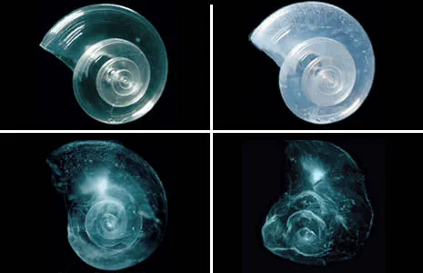

# Carbonated Ocean

**What happens to CO₂ in Earth's oceans?** - Make your own carbonate minerals, and discover the effects of ocean acidification using a SodaStream.

Last initially checked on 2024-08-05 by Peter Methley (pm631@cam.ac.uk) and double-checked on yyyy-mm-dd by Name (email@cam.ac.uk)

**Frequency of use:** N/A

## Tags

<!--- Start Tags (DO NOT REMOVE THIS COMMENT) --->

<!-- List of all possible major tags: Delete as appropriate -->

**Standard** (A standard CHaOS experiment, useable for all hands-on events.)

<!-- **Active** (Experiment has working equipment at the time of last update, and is available for events.) -->

**In development** (This experiment doesn't actually exist yet, but might in the future!)

**Chemistry**

**Geology**

**Requires Water**

**CHaOS+** (More complex explanations suitable for older children are available)

<!-- Add any more tags that are appropriate -->

<!--- End Tags (DO NOT REMOVE THIS COMMENT) --->

 

## Equipment Needed

**In the box:**

- SodaStream and its bottle
- Plastic dropping pipettes
- Test tubes
- Test tube rack
- Waste container
- Teaspoon measures
- Bottles or cups to hold solutions

**Consumables:**

- Distilled or Deionised Water (can be bought from auto supplies part of Tesco, etc.)
- Bicarbonate of Soda, NaHCO₃
- White Vinegar, CH₃CO₂H
- Calcium Chloride Dihydrate, CaCl₂⋅2H₂O (sold on Amazon, etc. as a salinity balancer for swimming pools)
- CO₂ gas cylinder for Sodastream - these can be refilled in shops like John Lewis. See [https://sodastream.co.uk/pages/store-locator](https://sodastream.co.uk/pages/store-locator) for locations
- Universal indicator paper (with integrated colour scale) - this can be bought on Amazon, etc.
- Teaspoon measures
- _Eggs (CBS Only)_

**Not in the box:**

- Plastic tray
- Shells? (Currently in Rocks & Fossils)
- Sample of limestone, calcite and aragonite? (Currently in Rocks & Fossils)
- _Small Tupperware for eggs (CBS Only)_

 

## Experiment Explanation

### Important points!

The CO₂ for the SodaStream is quite expensive and difficult to source. After making the first batch of carbonated water, re-use this for the rest of the day, just take a small amount out to test the pH and top it up with tap water. You can do one brief press of the button per group to show them how it works.

For safe operation of the SodaStream, always use the official gas cylinders and follow the SodaStream instructions.

### In a nutshell.....

Mix CaCl₂ and NaHCO₃ solutions to precipitate CaCO₃.

Show that water carbonated using the SodaStream is more acidic than tap water.

Show that making the solution acidic by adding vinegar stops carbonate precipitation.

### Set-up

- _CBS Only: Put some eggs to soak in vinegar (any kind) for at least a day before the event. Keep them in a sealed container, but you may need to periodically open it to vent CO₂ gas. The shell should soften and eventually disappear, leaving just the membrane holding the egg bits inside. Before starting, drain the vinegar, carefully rinse the eggs with water, and put them back into a sealed tupperware._

- Fill the SodaStream bottle to the ‘max’ line (not the flavouring line) with tap water, and another bottle with tap water.
- Insert the water bottle and the CO₂ cylinder into the SodaStream as indicated by the SodaStream instructions.
- Dissolve ~ 2.8 g (~ 3 tsp) CaCl₂⋅2H₂O into ~ 50 ml of deionised water in a container. The solution may be cloudy to begin with but will (hopefully) clear over tens of minutes.
- Dissolve ~ 1.7 g (~ 1.5 tsp) NaHCO₃ into ~50 ml of deionised water in another container.
- Also prepare a container of white vinegar.
- Label containers to make sure you know which is which!
- Also have a waste container handy. Waste from this experiment is non-hazardous and can be flushed down the sink with plenty of water.
- Put the infographic somewhere people can see it.
- Give the Sodastream around 5 good presses to carbonate the water (or you can let the first group of the day do this instead.)

### How to demonstrate

_CHaOS+: More nuanced points for over-16s are shown in italics. These can usually be ignored for younger children, unless they are particularly curious!_

  
<i>Graphic of carbon cycling in the ocean.</i>

#### The Carbonate Sink

- Start by showing the infographic and explain in broad terms how carbon gets into the ocean and what can happen to it.
- Say that we will be focussing on the carbonate sink, show shells and limestone
- These are made of calcium carbonate: Ca²⁺ + CO₃²⁻ → CaCO₃
- _CHaOS+: talk about the carbonate equilibria here: how do we get CO₃²⁻ from HCO₃⁻?_
- Do the reaction in a test tube by pipetting in ~1 ml of the sodium bicarbonate and calcium chloride solutions.
- A cloudy, white precipitate should form over the next 10 seconds or so – ask them what it is (CaCO₃).
- _CHaOS+: When doing the reaction like this, the precipitate you see is amorphous calcium carbonate (ACC) because the carbonate saturation is high enough to form it and it has a negligible kinetic barrier to its formation. This will gradually transform over time into more stable, crystalline calcite (or aragonite if magnesium is present). Many (if not all) biomineralising organisms are now known to initially precipitate ACC or ACMC (amorphous calcium-magnesium carbonate)_
- This is the reaction happening inside shellfish when they make their shells!
- _CHaOS+: Rather than mixing solutions, real biomineralising organisms use ion channels to pump in Ca²⁺ or pump out H⁺ (which will increase CO₃²⁻ by the carbonate equilibria)._
- CaCO₃ gets buried in rocks and therefore removes carbon from Earth's surface for millions of years.
- _CHaOS+: Carbonate precipitation on its own is not enough to remove CO₂, as it will actually make the oceans more acidic, shifting equilibria in favour of CO₂ and releasing 1 mol of CO₂ to the atmosphere for every 1 mol of CaCO₃. It needs to be paired with silicate weathering by carbonic acid, which removes 2 mol of CO₂:_

  _CaSiO₃ + 2CO₂ + 3H₂O → Ca²⁺ + 2HCO₃⁻ + Si(OH)₄_

  _Ca²⁺ + 2HCO₃⁻ → CaCO₃ + CO₂ + H₂O (here we are using HCO₃⁻ as this is the most common inorganic carbon ion in both NaHCO₃ solution and seawater)_

  _You may observe bubbles of CO₂ forming in the water following the carbonate precipitation, which is the CO₂ produced by this reaction._

#### Ocean Acidification

- Now ask what is changing in this system today. People will probably know that atmospheric CO₂ is increasing and that causes global warming
- This CO₂ also dissolves in the ocean – what might it do?
- Some people might suggest acidification; otherwise talk about what makes an acid and why CO₂ behaves as such:

  CO₂ + H₂O ⇌ HCO₃⁻ + H⁺
- Next, demonstrate the acidification. In a tray, put a drop of the tap water that was used to fill the sodastream on some universal indicator paper; get someone to read off the pH. It should be around 7 (neutral).
- _CHaOS+: Introduce them to the pH scale if they are not already familiar: pH = −log₁₀ {H⁺}, where {} denotes activity (similar to concentration in dilute solutions such as this). Since the equilibrium constant for H₂O ⇌ H⁺ + OH⁻ is about 10⁻¹⁴, if no acid or base is present then pure water has pH = 7. Acidic solutions have a lower pH, and alkaline solutions have a higher pH._
- Get someone to **briefly** press the sodastream button to inject more CO₂ into the (already fizzy) water.
- Ask people what it feels like to drink sparkling water (don't give it to them though; get them to remember). They can feel the bubbles (dissolved CO₂ coming out of solution) but it also tastes a little sour due to the acidity.
- Now, put a drop of the fizzy water onto the indicator paper. It should be around pH 6. So adding CO₂ has made our water more acidic. (N.B. do this straight away, as the pH will gradually return to neutral as the dissolved CO₂ degasses.)

#### Impacts of Ocean Acidification

- Ask what the impacts of this on shells might be. Some may know that carbonates react with acid and dissolve. Acid can also stop carbonates from forming.
- Repeat the precipitaion experiment above in another test tube, but this time add ~ 7 drops of vinegar before mixing the CaCl₂ and NaHCO₃ solutions.
- _CHaOS+: Note that we cannot just use the carbonated water here, as the CaCl₂ + NaHCO₃ mixture is at an unnaturally high supersaturation, so the precipitation can happen fast enough to see. The ethanoic/acetic acid in vinegar is much more concentrated than the carbonic acid in sparkling water._
- You might see bubbles of CO₂ degassing (as the carbonate equilibria are shifted towards CO₂) but no precipitate should form.
- This is because the acid from the vinegar reacts with the carbonate ion to make bicarbonate, so it cannot directly be used to precipitate CaCO₃.

  H⁺ + CO₃²⁻ ⇌ HCO₃⁻
- You can also add vinegar to the CaCO₃ that you precipitated earlier to show how it dissolves the carbonate.
  School years 8/9 and above will hopefully remember that acid + carbonate → salt + water + carbon dioxide.
  Here, the specific reaction is 2H⁺ + CaCO₃ → Ca²⁺ + H₂O + CO₂
- _CBS Only: If you prepared bouncy eggs, talk about how they were made, get someone to predict whether they would still be hard, then let them **gently** shake the tupperware that they are in to show that the hard shell has dissolved. This is something that they can try at home!_
- This poses a threat to marine life with thin shells or poor control over their internal chemistry, such as the pteropod (‘sea butterfly’): a very lightweight sea snail that gradually swims through the water column.
- _CHaOS+: While it is nice to think about ‘dissolving shells’, the oceans will still not become acidic enough to actually start dissolving shells for a (hopefully) long time! However, as the pH drops, biomineralising organisms will have to work harder to pump enough ions to reach ACC saturation, so they tend to struggle to form their shells._

  
<i>Shell of a pteropod dissolving over 45 days in simulated seawater for the ‘worst case’ CO₂ emissions by 2100. Photo credit: David Liittschwager/National Geographic Stock. </i>

#### Other (optional) points to mention

- Some people may mention coral bleaching: this is not thought to be direcly related to ocean acidification (the impact of acidic seawater on corals is still being studied) but is due to the higher temperatures due to rising CO₂ and climate change. The photoendosymbiotic zooxanthellae that live in coral are very sensitive and only live in a specific temperature range.
- This experiment focusses on ‘inorganic carbon’ (i.e. carbon in the +4 oxidation state) but we can also remove CO₂ from the atmosphere by the ‘organic carbon’ (oxidation state = 0) side of the carbon cycle, through photosynthesis and burial. Instead of carbonate rocks, organic carbon is geologically stored as fossil fuels – the much more rapid than usual release of this reservoir is the primary reason for the current rise in CO₂. Some people are considering ‘fertilising’ the oceans to speed up this sink, but this may have all sorts of unintented ecological consequences.
- Likewise, there is a lot of research being done into adding bases to raise the pH of the ocean so it will hold more CO₂ – ‘Ocean Alkalinity Enhancement’ (OAE). This might also cause trouble... Ironically, geologists also use the acronym ‘OAE’ for ‘Oceanic Anoxic Event’, which is what could happen if OAE is not managed properly!

#### After each experiment

- Put the top back on the vinegar bottle so it doesn't stink!
- Top up the Sodastream bottle to ‘max’ if necessary, then return the bottle to the Sodastream.
- Make sure all the calcium carbonate in the test tubes has dissolved by adding vinegar to the tubes until the solutions are completely clear.
- Empty the test tubes into a waste bottle and rinse with some water. Return to the rack.

### Packing away

The vinegar, CaCl₂ and NaHCO₃ solutions can be saved if there are some left. Make sure that the bottles are properly sealed before putting them back in the box! Everything else should be emptied down the sink along with plenty of water, rinsed and dried. The waste is not classified as hazardous. Remove the CO₂ cylinder from the Sodastream (being careful, as it could get cold). Return rock/shell samples to Rocks and Fossils. Put everything else except the tray back in the box.

 

## Risk Assessment

<!-- Hazard section: Copy and paste this for as many hazards that there are -->

### **Hazard**: Pressurised CO₂ gas

**Description**: Overpressurised containers could explode and cause injury, or leak and cause asphyxiation.

**Affected People**: All

**Before Mitigation**: Likelihood: 2, Severity: 5, Overall: 10

**Mitigation**: CO₂ is used in a commercial product that is rated for use at home by non-experts. Always follow the SodaStream safety instructions, which should be left in the box. In particular:

- Use only the official SodaStream bottle and gas cylinder. Check that they are in date and inspect for damage before demonstrating.
- Do not let the gas cylinder or bottle get damaged or hot.
- Fill the bottle with cold water up to the ‘max’ line (not the flavouring line). Do not add anything else to the bottle before carbonating.
- Don't attempt to carbonate an empty bottle.
- In the event of a leak, clear and ventilate the area, and breathe fresh air.

**After Mitigation**: Likelihood: 1, Severity: 5, Overall: 5

 

### **Hazard**: Depressurising CO₂

**Description**: Releasing pressure on the CO₂ could cause it to become very cold, with the potential to cause burns.

**Affected People**: All

**Before Mitigation**: Likelihood: 3, Severity: 3, Overall: 9

**Mitigation**: Limit the amount that the button is pressed. Check the CO₂ cylinder is not cold by first looking for frost, then using back of hand, before handling.

**After Mitigation**: Likelihood: 1, Severity: 3, Overall: 3

 

### **Hazard**: Vinegar, Bicarbonate, CaCl₂

**Description**: Vinegar (~ 0.8 M acetic acid), sodium bicarbonate solution (0.4 M) and calcium chloride solution (0.5 M) are irritant to eyes, and possible allergens

**Affected People**: All

**Before Mitigation**: Likelihood: 3, Severity: 3, Overall: 9

**Mitigation**: State reagents on a sign to highlight allergens. If participant(s) are allergic, they should stand well back and not touch anything.

Only use < 1ml of each reagent at a time – the small amount should limit the amount of effervescence. Don't let people look directly over the top of test tube when combining reagents.

Be extra careful when preparing stock solutions from solids, as more concentrated solutions are stronger irritants.

If in contact with eyes, wash with emergency eye wash provided if trained and confident to do so. Call first aider if necessary.

**After Mitigation**: Likelihood: 1, Severity: 3, Overall: 3

 

### **Hazard**: Glass test tubes

**Description**: If broken, could cause cuts.

**Affected People**: All

**Before Mitigation**: Likelihood: 2, Severity: 4, Overall: 8

**Mitigation**: Keep test tubes in rack at all times unless emptying/washing them. Don't let children handle test tubes.

Do not seal test tubes when doing a reaction as the CO₂ pressure produced could cause them to shatter.

If a test tube does get broken, carefully wrap in kitchen roll and dispose of it before continuing.

Call first aider in case of injury.

**After Mitigation**: Likelihood: 1, Severity: 4, Overall: 4

 

### **Hazard**: Vinegar, Bicarbonate, CaCl₂, _(Eggs)_

**Description**: Ingestion of these ingredients making people unwell. They are all non-toxic but are not very nice to eat (and may have been sitting around for a while)

**Affected People**: Public

**Before Mitigation**: Likelihood: 3, Severity: 2, Overall: 6

**Mitigation**: Don't let people drink the water out of the Sodastream, as it will have had pipettes put in it.

Don't leave children with experiment unsupervised. Only prepare a small amount (50 ml) of the solutions at a time. Put all unnecessary reagents back in the box and always leave the experiment safely packed away when closed.

If ingested, advise parents that reactants are all non-toxic, but to seek medical attention if child is feeling unwell.

**After Mitigation**: Likelihood: 2, Severity: 2, Overall: 4

 

### **Hazard**: Liquids

**Description**: Large spillages could be a slip hazard, could create electrical hazard if near electrical equipment.

**Affected People**: All

**Before Mitigation**: Likelihood: 3, Severity: 2, Overall: 6

**Mitigation**: Do wet chemistry inside plastic tray. Don't demonstrate near electical equipment.

Do not mix the solutions in large quantities (<1ml of each solution is necessary)

Clear spills promptly, use wet floor sign if needed.

Call first aider in case of injury.

**After Mitigation**: Likelihood: 2, Severity: 2, Overall: 4

 

### **CBS Only Hazard**: Eggs

**Description**: Bouncy eggs are easy to break, causing a big mess!

**Affected People**: All

**Before Mitigation**: Likelihood: 4, Severity: 2, Overall: 8

**Mitigation**: Keep eggs sealed in Tupperware at all times during demonstration. Only let people gently shake the Tupperware. Only start dissolving the eggshells a few days before the event so they don't go rotten!

**After Mitigation**: Likelihood: 2, Severity: 1, Overall: 2

 
<!-- End of hazard section. -->

## Risk Assessment Check History

**Check 1**: 2024-08-05 - Peter Methley (pm631@cam.ac.uk), **Check 2**: yyyy-mm-dd - Name (email@cam.ac.uk)

<!-- (duplicate as necessary) -->
