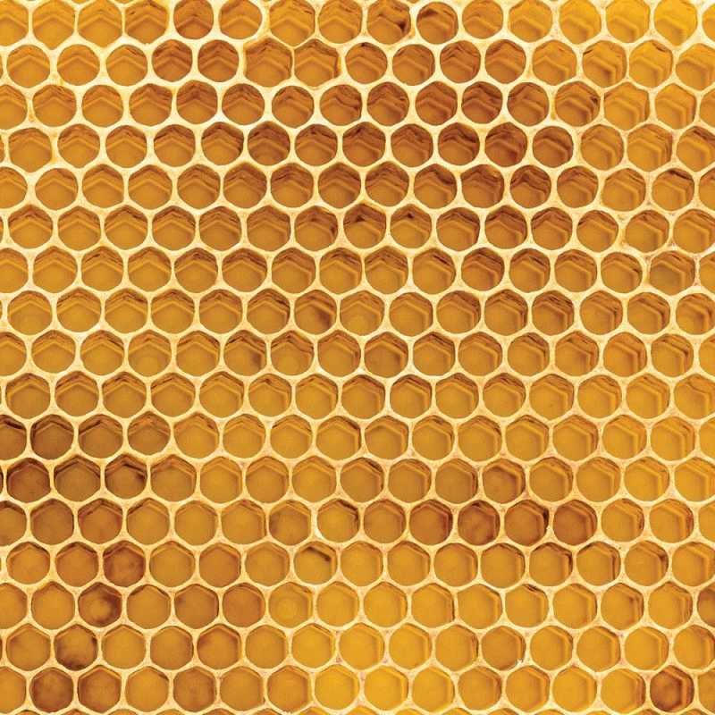
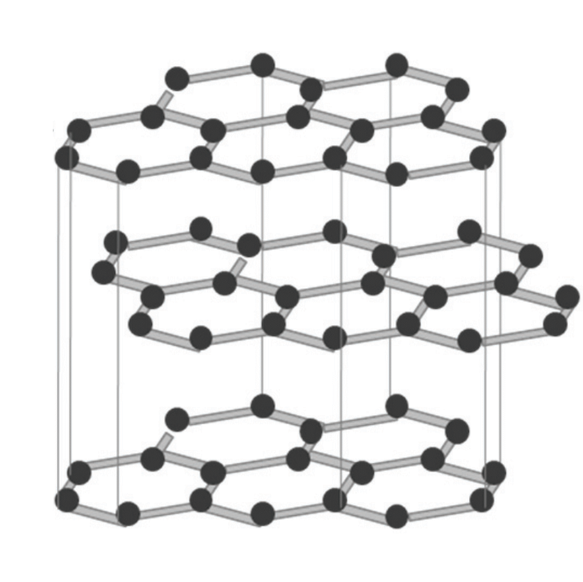
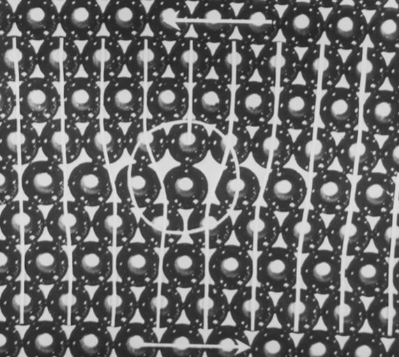
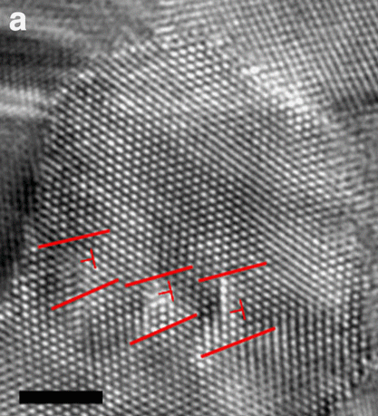

# Bubbly Crystals

**Modelling crystals with soap bubbles** - Using a raft of tiny bubbles, see how materials are made up of crystals and watch the atoms move when the material is deformed! (Or it’s just fun for little kids to play with the bubbles)

Last initially checked on 2022-01-13 by Peter Methley (pm631@cam.ac.uk) and double-checked on

**Frequency of use:** 4

## Tags

<!--- Start Tags (DO NOT REMOVE THIS COMMENT) --->

<!-- List of all possible major tags: Delete as appropriate -->

**Standard** (A standard CHaOS experiment, useable for all hands-on events.)

**CHaOS+** (More complex explanations suitable for older children are available)

**Active** (Experiment has working equipment at the time of last update, and is available for events.)

**Materials Science**

**Requires Water**

<!-- Add any more tags that are appropriate -->

<!--- End Tags (DO NOT REMOVE THIS COMMENT) --->

 

## Equipment Needed

- Black Tray
- Gas Generator (two bottles stuck together with their bottoms chopped off, and a thin tube – made from the insulation of an electrical cable – coming out with some Blu-tack on the end. The upper bottle should be full of rice or something else to weigh it down)
- Base of clear plastic bottle to put gas generator in
- 2 wooden skewers for manipulating bubbles
- Spare tube, rice and Blu-tack
- 7 plastic cups (or other equally-sized round objects)
- Quartz prism (example of a crystal)
- Laminated printouts of figures
- Fairy liquid (consumable) – note that cheap washing up liquid doesn't work very well!
- Kitchen roll (for popping bubbles and cleaning up)
- Requires ~100 ml of water (not included)

 

## Experiment Explanation

This experiment is based on a classic demonstration originally devised (and filmed!) by Sir Lawrence Bragg: Nobel laureate, former director of the Cavendish Laboratory and co-discoverer (along with his dad) of Bragg’s Law of Diffraction. His video is available here: [https://youtu.be/UEB39-jlmdw](https://youtu.be/UEB39-jlmdw); if you have an internet connection then watching this is recommended (though not strictly necessary) before demonstrating this experiment.

The following explanation includes quite a lot of detail: how much of this you include depends on your audience. For younger children, it might be better just to let them play with the raft, and you can point out anything interesting you see.

_A CHaOS+ explanation is available for this experiment; see additional details in italics._

### Set-up

Set the tray on a flat surface, and, using another container or bottle, fill it with water to about 5 mm depth. Add a small squirt (~1 ml) of liquid soap. Stir with your finger until the soap is mixed in, being careful to avoid making bubbles. Also fill the clear plastic half-a-bottle with water, to between the first and second lines from the bottom. Place the gas generator into this water.

Put the end of the green tube into the tray of soapy water so that it sits flat on the base of the tray – don’t let it poke up to the surface. Move the gas generator around and squash the blu-tack to help it stay down (though note that it won’t stick properly underwater).

 
 
<i>Fig 1: the setup for the experiment.</i>

### Making Bubbles

The weight of the gas generator causes it to sink into the water, pressurising the air inside the green bottle.  
_(CHaOS+: calculate the pressure using $\Delta p = \rho_w g \Delta h = m_\mathrm{gas~gen}g / A$)_  
This can escape (very slowly) through the small tube and into the water, making bubbles.  
_Q: What will be the effect on flow of increasing the pressure $\Delta p$ / radius of tube $r$ / length of tube $L$ / fluid viscosity $μ$?_  
\_A: Flow rate $Q$ calculated using Hagen-Poiseuille Equation: $Q \approx \pi r^4 \Delta p / 8\mu L$ (Not exact as air is compressible). As the air is used up, the bottle sinks lower, maintaining a constant $\Delta h$ and therefore flow rate, so the bubbles stay the same size.)_

If all is well, small bubbles should now be coming out of the tube and settling on the surface of the water. If not, try pressing down on the gas generator – if this works then you might need to add more weight so it works automatically. Otherwise, try checking the seal of the cap on the green bottle in the gas generator.

This experiment works best if the bubbles are all a uniform size, which they should be if the generator is working properly. If you ever need to take the tube out of the water, wipe the end before putting it back in – otherwise larger bubbles will have built up there. Any spurious large bubbles can be popped by using a small piece of kitchen roll to absorb their water.

The bubbles should be able to stick around for minutes to hours once made – if they are popping too quickly, add more soap to the water. If too many bubbles have built up, empty the tray and refill with fresh water and soap (a quick fix is to push them to the edge and then fish as many of them out as you can).

The experiment uses a single layer of bubbles: if they stick around near the tube for too long, they can start forming a double layer, so waft them away from the tube with a skewer.

Some people might ask why the bubbles stick together: if you look at the water surface around a bubble it dips downwards slightly (surface tension makes it behave a bit like a trampoline with a weight on it) - when two bubbles approach they 'fall into' each others' dips.

### Forming Crystals

The bubbles will aggregate to form a regular pattern, analogous to a crystal lattice. **Crystals** have a regular structure or pattern that repeats in space, though made of atoms/ions/molecules rather than bubbles. This particular arrangement is known as **hexagonal close packing** (HCP) – ask children if they can identify the hexagons. HCP is the most space-efficient way to arrange a sheet of spheres, which is why HCP structures occur in nature (e.g. honeycomb, and graphite; Fig 2). _(It is also the lowest energy and therefore most thermodynamically favoured: the tension in the walls of the bubbles creates elastic potential energy, and having an HCP arrangement enables the greatest length of these walls to be shared with adjacent bubbles, minimising the energy per bubble)_

You can use the seven cups to let children work this fact out for themselves. Arrange them randomly on the table, then ask a volunteer to imagine they are all attracting each other like the bubbles are, then to push the cups together so they occupy as small a space as possible. This should have naturally made a HCP arrangement.

  
<i>Fig 2: naturally-occurring hexagonal close-packed structures: honeycomb and graphite. The bubble raft is most similar to graphene – a single sheet of graphite.</i>

_Q: How would you extend this into 3D?_ 
_A: By putting the next layer of spheres in the gaps between those in the first layer, then filling the gaps in the second layer, etc. You can demonstrate this by allowing a double layer of bubbles to build up near the tube. There are two options for repeating this tiling in the z direction: ABAB… (3D HCP, e.g. zinc) or ABCABC… (Cubic close packing, aka face-centred cubic, e.g. copper). See Fig 3._

 
<i>Fig 3 : 3D close-packed structures</i>
<!-- Andrew suggests getting a model of this! -->

_Crystal growth can be observed by two methods. Addition of one bubble at a time to an existing crystal is analogous to the ‘classical’ view of crystal growth, ion by ion. The addition is favoured at any ‘kink sites’ with missing bubbles on the outside of the crystal. Crystals can also grow by the formation of smaller nuclei (made of several bubbles, often with a more irregular structure), followed by their aggregation and alignment with the crystal lattice. This is known as ‘oriented attachment’ – such ‘non-classical crystal growth’ has been the subject of much research in materials science and mineralogy in the last decade._

### Polycrystalline Materials

After enough bubbles have accumulated, you should see that the lattice is not going in the same direction throughout the raft. Instead, there will be regions where the lattice is in different orientations – each region is a separate crystal, or **grain**. The **grain boundaries** separating crystals of different orientations are characterised by a series of defects in the lattice. Ask the children to point out some separate grains, and they can attempt to make their own grain by pulling in a new cluster of bubbles with a skewer. Most metals, rocks, etc are made up of multiple crystals in this way.

<!-- To do: include a rock or etched metal object that shows the polycrystalline structure clearly -->

_A 2D lattice can be described by two **lattice vectors**, $\mathbf{a}$ and $\mathbf{b}$. Translation by either of these (or a linear combination of their integer multiples) will leave the lattice invariant. Ask the student to point out the lattice vectors, maybe on a scaled-up drawing of the lattice. The misorientation between two grains is the smallest angle between equivalent lattice vectors in each grain._ 
_Q: What is the maximum misorientation in this HCP lattice?_ 
_A: 30°. A rotation of 60° will bring the lattice back into alignment._

 
<i>Fig 4: three grains, with the lattice orientations for each drawn. Note the defects on the grain boundaries. Screenshot from the Bragg video.</i>

### Deformation and Dislocations

Take the two skewers (or have a child do it) and constrain two edges of the raft with them. This works better once there are a lot of bubbles. Then move one skewer relative to the other to stretch, squash or shear the raft and see how the deformation is accommodated. There are three ways in which a polycrystalline material like this raft can deform:

**Elastic deformation:** If the skewers are only slightly moved, the whole raft can stretch or squash like a spring. No bubbles move relative to their neighbours. When the force is released, the raft returns to its original shape.

Moving the skewers more results in… 
**Grain boundary sliding.** As the name suggests, this is when crystals slide past each other along their boundaries. This deformation is now permanent (_plastic deformation_): the grains will not slide back when the force is removed. Grain boundary sliding allows dry sand to be poured like a fluid, _and is the dominant method of deformation in fault zones in the upper crust._

The grains themselves can also change shape (also permanently/plastically). This is done through… 
**Movement of Dislocations.** You might have spotted little defects in the crystal lattice (e.g. a row that stops suddenly), even within a single grain. These defects are known as **dislocations**.

 
<i>Fig 5: Dislocation within a bubble ‘crystal’. Note how there is an extra column of bubbles on the top compared to the bottom. This dislocation has a Burgers vector of 1 bubble diameter to the left, and will move to the left to relieve the applied stress. Screenshot from the Bragg video.</i>

When the crystal is deforming, you can see the dislocations zipping from one side of the grain to the other. They are created where the stress on the lattice is greatest (at irregularities on the grain boundaries), and when they reach another grain boundary they get stuck and may contribute to some grain boundary sliding. They leave the grain permanently deformed in a way that reduces the stress that acted on it. When the direction of stress is reversed, the dislocations start moving the other way.

_Q: Why do crystals deform in this way?_ 
_A: Compared to moving a whole row of bubbles/atoms at once, moving a dislocation has a much lower energy barrier as only a few bonds need to be strained at a time compared to the hundreds (or millions in real crystals) in a row of a crystal lattice. However, once the dislocation has made it to the other side, the net effect is the same._

_The direction a dislocation will move in can be calculated by counting the same number of bubbles horizontally and vertically in a circuit around the dislocation: the offset that is left over is the **Burgers Vector**. Dislocations can combine, adding their Burgers vectors together. The stress field around a dislocation can also influence other dislocations, causing them to attract or repel each other. See the Bragg video (5:35 to 12:07) for more details on this._

_In addition to elastic deformation, grain boundary sliding and dislocation creep, real crystals can also deform by **diffusion creep**, where individual atoms/ions move from one side of the crystal to the other. However, I have not seen a good analogy for this in the bubble model._ 
_Q: What conditions would favour diffusion creep?_ 
_A: High temperatures (more thermal movement of ions); presence of a solvent (e.g. water) that can dissolve the ions and help them move._

The bubble raft experiment was developed in 1952 to study dislocations, which at the time were only theoretical predictions. Real dislocations were first observed four years later ([Hirsch _et al._, 1956](http://dx.doi.org/10.1038/ncomms5402)) after the development of high-resolution transmission electron microscopy, and were found to behave almost exactly as the bubble raft experiment predicted!

 
<i>Fig 6: Electron microscope image of real grain boundaries and dislocations (marked in red) in a crystal of platinum. Scale bar is 2 nm (that is 0.000000002 m!) From <a href="http://dx.doi.org/10.1038/ncomms5402">Wang et al. (2014)</a>.</i>

### Vacancies and Impurities

As well as the dislocations and grain boundaries, you may be able to see other types of defects in the crystals.

A **vacancy** is a site where a bubble is missing. They often occur naturally but, if not, you can create one by popping a bubble with kitchen roll. A passing dislocation can fill in a vacancy, jumping over a row in the process.

A bubble of the wrong size resembles an **impurity**, e.g. an atom of carbon in a lattice containing mostly iron. Impurities stress the surrounding lattice, and cause passing dislocations to get stuck.

Q: What are the implications of this for how easy the crystal is to deform?  
A: Since the movement of dislocations is hindered, the crystal becomes harder to deform, and the material is therefore stiffer. This is the principle behind **alloying** metals: the deliberate introduction of impurities (e.g. carbon in steel) makes the metal less soft and bendy.

### Recrystallisation

Stir up some of the raft using the skewers or an enthusiastic child’s hand! This destroys the regular crystal structure and is analogous to damage caused by quick deformation (**work hardening**) of metals, or radiation damage in minerals.

However, the bubbles will soon rearrange themselves into a regular lattice again, forming new grains and grain boundaries. The grains will be small at first, but get bigger over time (**annealing**), especially if the tray is shaken to simulate thermal agitation.

_Q: Why does this happen?_ 
_A: To minimise energy. A perfect crystal structure has lower energy than a random arrangement of bubbles, as each ‘bond’ between the bubbles is an optimal length. The mismatch at grain boundaries also increases energy, so energy is further minimised by minimising the total length of grain boundaries. However, doing this requires rearranging the bubbles, which is only possible if there is enough ‘thermal’ agitation to move them._

_Q: Therefore, under what conditions is a coarse-grained metal / metamorphic rock formed, compared to a fine-grained one?_ 
_A: A coarse-grained texture requires the material to be held at a high temperature for a long time, to give the ions the chance to move into the most thermodynamically-favourable arrangement._

### Packing away

Carefully empty the tray and gas generator and dry with the paper towel provided. Stack up the cups. Put everything back in the box.

 

## Risk Assessment

<!-- Hazard section: Copy and paste this for as many hazards that there are -->

### **Hazard**: Pointy skewers

**Description**: Getting poked (particularly in eyes); splinters

**Affected People**: Demonstrator and demonstratees

**Before Mitigation**: Likelihood: 4, Severity: 4, Overall: 16

**Mitigation**: No pointing skewers near people’s faces. Don’t let young children hold skewers (they can use fingers if not allergic to soapy water); sand down any rough and sharp bits before use

**After Mitigation**: Likelihood: 1, Severity: 4, Overall: 4

 
<!-- End of hazard section. -->

### **Hazard**: Soapy water

**Description**: Skin irritation for people with cuts / eczema / allergies

**Affected People**: Demonstrator and demonstratees

**Before Mitigation**: Likelihood: 2, Severity: 3, Overall: 6

**Mitigation**: I would advise against demonstrating if you are irritated by soapy water. Ask parent/ responsible child if OK to put their hands in soapy water. Otherwise, can do as demo only or only let them touch the water via the skewers. Do not let children drink the soapy water.

**After Mitigation**: Likelihood: 1, Severity: 3, Overall: 3

 

### **Hazard**: Soapy water

**Description**: Eye irritation

**Affected People**: Demonstrator and demonstratees

**Before Mitigation**: Likelihood: 4, Severity: 3, Overall: 12

**Mitigation**: Don’t let anyone who touched the soapy water with their fingers touch their eyes without drying their hands first. Know where the nearest eye wash is (there should at least be some in the Safety box). Summon first-aider to wash eyes if necessary.

**After Mitigation**: Likelihood: 2, Severity: 3, Overall: 6

 

### **Hazard**: Open containers of water

**Description**: Trips / slips / electrical shorts from spillages.

**Affected People**: All

**Before Mitigation**: Likelihood: 3, Severity: 3, Overall: 9

**Mitigation**: I would advise doing this experiment outside or in a room with a wipeable floor. Do not put near electrical equipment. Do not use more water than is necessary (5mm depth is fine), and if possible fill the tray using a water bottle and then don’t move it. Keep the gas generator in a place where it is difficult to knock over. Warn people of any spillages and clear them up promptly using the kitchen roll. Summon first-aider in event of someone tripping and hurting themselves.

**After Mitigation**: Likelihood: 2, Severity: 3, Overall: 6

 

## Risk Assessment Check History

**Check 1**: 2022-06-06 - Andrew Sellek (ads79@cam.ac.uk), **Check 2**: 22-06-09 - Emma Crickmore (elc75@cam.ac.uk)

**Check 1**: 2022-01-13 - Peter Methley (pm631@cam.ac.uk), **Check 2**: 

<!-- (duplicate as necessary) -->
