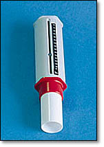
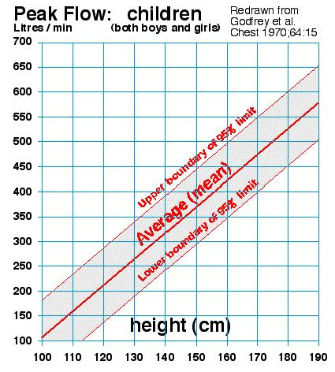

# Peak flow

**Using a peak flow meter to measure peak flow rates** - A peak flow meter often used by medical staff to measure the maximum speed you can expel a 'huff' of air. This can be used to gather useful information about the function of the lungs.

Last initially checked on 2025-02-08 by Jessica Trevelyan (jet81@cam.ac.uk) and double-checked on 2025-02-08 by Margaret Johncock (mllyj2@cam.ac.uk)
## Tags
<!--- Start Tags (DO NOT REMOVE THIS COMMENT) --->

**Active** (Experiment has working equipment at the time of last update, and is available for events.)

**CBS only** (Non-transportable experiments that tend to be used for CBS only.)

**Medicine**
<!--- End Tags (DO NOT REMOVE THIS COMMENT) --->

 

## Equipment Needed 
- Peak flow meter & disposable mouth pieces
- Peak flow meter
- Models of normal and constricted airways (made from foam and tape)
- Straws
- Bung with a hole in it, plus blu-tac (possibly, if I have finished making it!)

 

## Experiment Explanation 

This experiment allows kids to have fun competing to see who has the highest peak flow and also acts as a starting point for discussion of lungs, breathing and conditions such as asthma.  

ACTIVITIES:  
- Get kids to use a peak flow meter

Image 1:

THINGS TO TALK ABOUT:
- What is a peak flow meter and what might it be used for?
- Basic explanation of how the lungs work
- Why do you want to know about your peak flow rate? asthma, fibrosis, COPD etc

TIPS FOR DEMONSTRATING:  
It's very important to establish in the beginning how much the kid knows already. Generally, kids either know a lot (i.e. if they are asthmatic) or very little. If they know very little, keep things very basic. If they know a lot, you can go into more detail; i.e. how the lungs work; that lungs are made out of tissue; tissue structure can change (inflammation; fibrosis)- how this affects your breathing.  

BASIC PROCEDURE AND EXPLANATION  

Peak Flow  

1. Establish how much the child knows already:
- Ask them if they know what a peak flow meter is.
- If they do ask them what it's used for (chances are a good chunk of them have asthma and will have used one).
- If they don't know what it is, ask them what they think it might be used for.
- This should be quite easy to guess from the design, but if they're struggling, work them round to it.
- Point out the meter - i.e. it's for measuring something.
- At the 0 end of the meter there's a wacking great mouth shaped hole, so how do you think you get the meter to move?
- If they say blowing into, then ask them what sort of diseases it might be used for. asthma, emphysema, bronchitis.

2. Then link what it's for to a discussion on asthma.
- So if it's for seeing how well someone with asthma breaths, do you think asthmatics can blow more or less on it?
- Why do they blow less. (see diagram below)
- Lungs = set of bags at end of set of tubes.
- Ref them to lung model for how lungs work, but basically say muscles make air move in and out.
- In asthmatics, the tubes are narrower.
- Tubes are narrower because...
- Need to pitch this depending on age of kid.
- Mention allergy.
- Mention other things that can trigger, eg asthma, cold air.

3. Do only kids have asthma?
- No - adults can get it as well. Late in life onset and child onset forms of asthma are common.

4. So do you thinks astmatics blow the same thing on the peak flow all day?
- No - they are usually worse in the morning that they are in the evening.

5. Finally, see what the kids can blow and match it vs. the diagram below.

Image 2:

6. For older kids it might be worth going into:
- Why narrower tubes stop you blowing as well.
- Inflammation.
- Other things that you use lung function tests for: COPD, Sarcoidosis, Fibrosis etc.  

You can also get kids to put a straw in their mouth and breathe out through it for a few breaths, to demonstrate how much more difficult it is to exhale through smaller tubes. Only let them do this if they are sensible, breathe normally for only a few breaths, and are SITTING DOWN while they do so!  

It might also be possible to plug the end of a mouthpiece with the rubber bung, put a straw through the bung (you will need blue tack to make it airtight) and then compare the peak flow reading that can be achieved blowing through the straw to that blowing straight through the mouthpiece, again demonstrating the effects of narrowed airways.  

 

## Risk Assessment

### **Hazard**: Mouthpiece

**Description**: Transfer of infection from mouthpiece.

**Affected People**: Public

**Before Mitigation**: Likelihood: 3, Severity: 2, Overall: 6

**Mitigation**: Make sure to use a new mouth piece each time, and dispose of old ones.

**After Mitigation**: Likelihood: 1, Severity: 2, Overall: 2

 

### **Hazard**: Over-Exertion

**Description**: Fainting risk due to over-exertion/hyperventilation.

**Affected People**: Public

**Before Mitigation**: Likelihood: 2, Severity: 3, Overall: 6

**Mitigation**: Keep an eye on people using the peak flow meter to ensure that they are not over-exerting themselves to this point. If child tries to breath too rapidly, tell child to slow down. Be aware of what participants might fall on in the event of fainting. Only allow them to try the exhaling through straws part if they are SITTING DOWN, and only let them do so for a few, gentle breaths.  
In case of accident, call a first aider.

**After Mitigation**: Likelihood: 1, Severity: 3, Overall: 3

 

 

### **Hazard**: Choking risk

**Description**: Risk of choking if straw is inhaled when blowing out through straw if children are messing about.

**Affected People**: Public

**Before Mitigation**: Likelihood: 2, Severity: 5, Overall: 10

**Mitigation**: Keep an eye on students if several kids are doing the exhalation through straws activity. If children are messing around/being unsafe immediately intervene and stope the experiment. If people are sitting as recommended above this should not occur.
In case of accident, call a first aider and encourage child to cough.

**After Mitigation**: Likelihood: 1, Severity: 5, Overall: 5

 

## Risk Assessment Check History 

**Check 1**: 2012-01-11 - Elizabeth Mooney (erm40@cam.ac.uk), **Check 2**: 2012-01-23 - Ashley Smith (ashley.smith@cantab.net)

**Check 1**: 2013-01-08 - Ophelia Crawford (oc251@cam.ac.uk), **Check 2**: 2013-01-24 - Jaimie Oldham (jlo40@cam.ac.uk)

**Check 1**: 2014-01-21 - Catherine Bi (catherine.bi@cantab.net), **Check 2**: 2014-01-26 - Sharmila Walters (sw632@cam.ac.uk)

**Check 1**: 2015-01-08 - Charlotte Attwood (ca402@cam.ac.uk), **Check 2**: 2014-01-23 - Jessica Gorman (jrg63@cam.ac.uk)

**Check 1**: 2016-01-05 - Charlotte Attwood (ca402@cam.ac.uk), **Check 2**: 2015-02-12 - Richard "Miffles" Mifsud (rwm41@cam.ac.uk)

**Check 1**: 2017-02-11 - Fiona Coventry (fiona.coventry@cantab.net), **Check 2**: 2016-02-02 - Jiali Gao (jg732@cam.ac.uk)

**Check 1**: 2018-01-27 - Matt Worssam (mdw47@cam.ac.uk), **Check 2**: 2018-02-05 - Esmae Jemima Woods (ejw89@cam.ac.uk)

**Check 1**: 2019-01-25 - Matt Worssam (mdw47@cam.ac.uk), **Check 2**: 2019-02-04 - Josh Garfinkel (jlg70@cam.ac.uk)

**Check 1**: 2020-01-27 - Samuel Amey (sra44@cam.ac.uk), **Check 2**: 2020-01-27 - Beatrix Huissoon (beh37@cam.ac.uk)

**Check 1**: 2021-01-21 - Samuel Amey (sra44@cam.ac.uk), **Check 2**: 2021-01-22 - Richard "Miffles" Mifsud (rwm41@cam.ac.uk)

**Check 1**: 2022-01-28 - Sian Boughton (seb216@cam.ac.uk), **Check 2**: 2022-02-09 - Jessica Trevelyan (jet81@cam.ac.uk)

**Check 1**: 2023-02-17 - Emily Wolfenden (elw74@cam.ac.uk), **Check 2**: 2023-02-23 - Andrew Sellek (ads79@@cam.ac.uk)

**Check 1**: 2024-02-15 - Charlotte Marshall (csm69@cam.ac.uk), **Check 2**: 2024-02-15 - Isobel Gilham (ig419@cam.ac.uk)

**Check 1**: 2025-02-08 - Jessica Trevelyan (jet81@cam.ac.uk), **Check 2**: 2025-02-08 - Margaret Johncock
