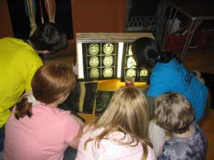

# X-Rays

**A collection of X-rays and other forms of medical diagnostic imagery.** - Have you ever had an X-ray? Have you ever wondered how they work? Take a look at our collection of exciting X-rays and MRI scans, test your anatomical knowledge and diagnostic skills and find out about the physics behind the images. 

Last initially checked on 2025-11-23 by Jeovana Ip (jci25@cam.ac.uk) and double-checked on 2025-01-12 by Margaret Johncock (mllyj2@cam.ac.uk)

## Tags
<!--- Start Tags (DO NOT REMOVE THIS COMMENT) --->

**Standard** (A standard CHaOS experiment, useable for all hands-on events.)

**Active** (Experiment has working equipment at the time of last update, and is available for events.)

**Medicine**
<!--- End Tags (DO NOT REMOVE THIS COMMENT) --->

 

## Equipment Needed 
- **Electricity needed**
- X-ray light box.
- Collection of X-rays and MRIs.
- Kettle lead with 'right-angled' end that fits.
- Torch.

 

## Experiment Explanation 

- General - What is it? Do they know when are they taken (when someone might have a fracture) and where? Asking whether they know anyone who's had one or had a plaster cast can be a good way to start. 

How do X-rays work? You can talk about the production of X rays to older kids - it involves very high voltages across metal, releasing photons which travel along and get stopped by things which are dense and/or which have high molecular mass (this is why calcium shows up, and explains blood being somewhat radioopaque because of its iron content - you can see blood in the heart, and you can also visualise it on CT scans, which are just X-rays taken at loads of different levels and cunningly put together). The X-ray film starts white and becomes black where the photons hits it, therefore non-dense things, e.g. gas, look black on film and dense things, e.g. metal, stay looking white.

Smaller kids will appreciate something a bit like light which can go through softer things e.g. skin but not harder things e.g. bone, metal implants. Likening it to a shadow can be useful. Of course then explaining a barium enema can be tricky, but you could describe it as "special liquid which can be seen on X rays".

Basically, you can go through the X-rays however you like and develop your own spiel. Here are some ideas:

- Ask lots of questions, get them to work out what everything is for themselves (our skeleton can help with this). If they're young it will 
 probably take them half an hour to work out what they're looking at.
- What are bones for? (support, locomotion, protection - see Skeleton explanation)
- Skull X-ray - why do we have big spaces in our skull? (decrease weight)
- why do some of the teeth look different? (fillings - can talk about x-rays not passing through metal)
- Chest X-ray - identify the bones (ribs, clavicles, spine)
- Identify the organs (big spaces are air-filled lungs, the thing in the middle is the heart - they're always amazed by how low and 
 central it is)
- But X-rays go through soft bits? What is the heart made of? How can we see it on the X-ray? Do bones have metal in 
 them? (calcium - they usually know this or will get it with prompts about why you should drink milk to keep your bones strong) 
- What is the heart full of? Does blood have metal in it then? (iron - they may not know this).
- Hand and foot X-rays - did they know they have so many bones in their foot/hand? Get them to feel the bones in their palm. Compare their 
 hands to Boris if he's nearby.
- Angiograms/enemas - can talk about using contrast (dense liquids) to highlight structures we wouldn't normally be able to see.

MRI images

- First point - these images were donated by a committee member, so they are not anonymised as all the radiographs (which are teaching images) are. This is fine - you just might need to know as we have in the past had members of the public tell us off for using identifiable images, but it's ok as we do have full permission!
- Compare with X-rays e.g. can see soft tissues - when might this be useful?
- How does it work? The machine contains an extremely strong magnet. This makes all the water molecules in your body line up in the same direction they may have played with compasses in magnetic fields at school). The machine then fires radio waves at the body. This knocks all the little spinning water molecules slightly out of line, but a different amount out of line depending on the type of tissue it's in. When the radio wave is turned off, the molecules all flick back to where they were in the magnetic field, releasing energy in different amounts depending on how out of line they were earlier. This energy release is captured by sensors and turned into an image.

List of Radiographs (correct as of December 2020):

Human:
1. Gastrointestinal Tract- double contrast (gas and barium)
2. Gastrointestinal Tract
3. Chest 
4. Hands
5. Pinned Femur
6. Dislocated Shoulder
9. Left foot
10. Spinal cord at shoulder level
11. Pelvic Fracture
12. Knee- displaced patella
13. Forearm
14. Skull 2 views- radiodense (bright white) tooth = filling
15: Dislocated Elbow
16: Angiogram Lung 
3xMRI of spinal cord

New batch of Animal X-Rays from Queens Veterinary Schools Hospital - these have had patient/owner details cut out and could rip along cutting lines so try to avoid this! (Jennifer's X-rays folder):
1. Dog, fractured right femur, urinary catheter in place
2. Dog, plate used to repair fractured femur
3. Dog, plate has been used to repair the fractured femur, urinary catheter in place
4. Cat, normal cervical spine
5. Dog, normal spine of a dog
6. Dog, normal thorax of a dog
7. Dog, leg extended. normal pelvis 
8. Cat, fractured left femur
9. Cat, fractured left femur
10. Cat, internal repair of a fractured femur 
11. Cat, domestic shorthair, external fixator on the tibia, rushpin technique on the femur to allow repair without damage to the growth plates
12. Dog, cranial cruciate ligament rupture- soft tissue within the joint, tibia is mildly displaced cranially. Also evidence of osteoarthritis.
13. Dog, TPLO (Tibial Plateau Levelling Osteotomy) used to repair the cranial cruciate ligament rupture
14. Dog, normal stifle for comparison
15. Horse, lateromedial radiograph, front foot and hind foot. Can see the shoes, nails attaching the shoes, phalanges, navicular bone, proximal sesamoids and the start of the metacarpus/metatarsus. Radiopaque hairline marker helps assess the angles within the foot and possibly help diagnose laminitis

Other animal X-rays in this folder (blue stickers):

2. Male dog angiogram - can ask about what the most important organs are (can see these as those with greatest blood supply), contrast these with limbs which have far less blood supply - important in reducing heat loss, and possible because there are no major organs in limbs and most muscles are proximal (meaning the distal limbs are mainly bone and connective tissue, which require very little blood supply)
4. Arteries of the head (dog and sheep) - can ask about why the brain needs such a good blood supply - very important organ with high energy and oxygen demand (one of the few organs which cannot survive any period of hypoxia - neuron cell death begins 4-6 minutes after blood flow stops). It also has many different large arteries going into the brain, as if there was only one and it got damaged/blocked this would cause death as brain tissue cannot survive long without oxygen (about 2-3 minutes). As it is, only a small area of the brain will be damaged - this is what a stroke is - as the other arteries will continue to supply most of the brain.
- Following on for this, can ask why the nose also has high blood supply (esp. clear in sheep) - smell is a vital sense for survival in both sheep (prey) and dogs (predators) and requires energy and oxygen to allow adequate sensitivity for their needs. The nose is also important in cooling blood going to the brain and heating air breathed out through the nose which allows thermoregulation.
9. Dog intestine and pelvis lateral view - black areas in abdomen are gas build up in intestines which is normal

Other Animal X-Rays in black case:

For the exotic ones there's an information sheet which shows which X-ray is which and tells you about the animals. There are pictures of the animals which line up with the X-rays, which is good for young children as they enjoy matching them up. There should be:
- Common marmoset
- European rabbit
- Joey kangaroo
- Pumpkinseed sunfish
- Frontsa cichlid (fish)
- Green tree python
- Western diamondback rattlesnake
- Infant green iguana
- Dwarf crocodile eggs
- Veiled chameleon
- Box turtle with eggs
- Red-tailed hawk
- Turkey vulture
- Leaf Frog

Others:
1. Puppy angiograms x2 dorsoventral and lateral views - same interesting points as dog angiogram, also have epiphysis at joints.
3. Cat Barium Contrast study - shows the presence of megaoesophagus = dilation of the oesophagus which means that most food cannot get to the stomach (instead will be regurgitated, will see weight loss because of this), can feed animals in special chairs that sit them upright like a human so gravity can help food reach the stomach.
6. Bird skull
7. Puppy pelvis - shows left hip displacement and growth plates
8. Dog intestines barium contrast study - shows food in stomach and poo in rectum

 

## Risk Assessment

### **Hazard**: Light box

**Description**: Electrical hazard from light box.

**Affected People**: All

**Before Mitigation**: Likelihood: 2, Severity: 4, Overall: 8 (High)

**Mitigation**: See electrical parts RA (attached)

**After Mitigation**: Likelihood: 1, Severity: 4, Overall: 4 (Medium)

 

### **Hazard**: Light box (fluorescent tube)

**Description**: Flicker from the fluorescent tube in the light box has the potential to induce seizures in individuals with photosensitive epilepsy.

**Affected People**: All

**Before Mitigation**: Likelihood: 2, Severity: 4, Overall: 8 (High)

**Mitigation**: Discourage demonstrators with epilepsy from choosing this experiment, and the public from staring too closely at the light box for prolonged periods. If they complain of feeling unwell switch the box off and advise them not to look at it further. Switch off the light box if necessary. 

Call a first aider in the event of injury.

**After Mitigation**: Likelihood: 1, Severity: 4, Overall: 4 (Medium)

 

### **Hazard**: Light box (weight)

**Description**: Possible risk of light box falling off table onto people.

**Affected People**: All

**Before Mitigation**: Likelihood: 3, Severity: 2, Overall: 6 (Medium)

**Mitigation**: Ensure that the light box is not close to the edge of the table and is in a stable position. 

Call first aider in case of injury.

**After Mitigation**: Likelihood: 2, Severity: 2, Overall: 4 (Medium)

 

### **Hazard**: Light box (heat)

**Description**: Possible risk of light box getting too hot and scalding users.

**Affected People**: All

**Before Mitigation**: Likelihood: 5, Severity: 3, Overall: 15 (High)

**Mitigation**: Warn the students that the light box is hot at the start of the experiment.

Call first aider in case of injury.

**After Mitigation**: Likelihood: 4, Severity: 3, Overall: 12 (High)

 

## Risk Assessment Check History 

**Check 1**: 2012-01-11 - Elizabeth Mooney (erm40@cam.ac.uk), **Check 2**: 2012-01-23 - Ashley Smith (ashley.smith@cantab.net)

**Check 1**: 2013-01-08 - Ophelia Crawford (oc251@cam.ac.uk), **Check 2**: 2013-01-24 - Jaimie Oldham (jlo40@cam.ac.uk)

**Check 1**: 2014-01-21 - Catherine Bi (catherine.bi@cantab.net), **Check 2**: 2014-01-27 - Sharmila Walters (sw632@cam.ac.uk)

**Check 1**: 2015-01-10 - Alisha Burman (arb95@cam.ac.uk), **Check 2**: 2015-02-12 - Richard "Miffles" Mifsud (rwm41@cam.ac.uk)

**Check 1**: 2016-01-05 - Charlotte Attwood (ca402@cam.ac.uk), **Check 2**: 2016-02-07 - Charis Watkins (czrw2@cam.ac.uk)

**Check 1**: 2017-02-11 - Fiona Coventry (fiona.coventry@cantab.net), **Check 2**: 2017-02-12 - Andrew Sellek (ads79@cam.ac.uk)

**Check 1**: 2018-01-27 - Matt Worssam (mdw47@cam.ac.uk), **Check 2**: 2018-02-07 - Benjamin Akrill (bja32@alumni.cam.ac.uk)

**Check 1**: 2019-01-13 - Polly Hooton (prh43@cam.ac.uk), **Check 2**: 2019-01-25 - Matt Worssam (mdw47@cam.ac.uk)

**Check 1**: 2019-12-23 - Polly Hooton (prh43@cam.ac.uk), **Check 2**: 2020-01-10 - Esmae Jemima Woods (ejw89@cam.ac.uk)

**Check 1**: 2021-01-18 - Polly Hooton (prh43@cam.ac.uk), **Check 2**: 2021-01-20 - Conor Cafolla (ctc43@cam.ac.uk)

**Check 1**: 2022-02-09 - Grace Exley (gae23@cam.ac.uk), **Check 2**: 2022-02-09 - Maggie Goulden (mcg58@cam.ac.uk)

**Check 1**: 2023-01-22 - Jessica Trevelyan (jet81@cam.ac.uk), **Check 2**: 2023-01-22 - Jamie Barrett (jb2369@cam.ac.uk)

**Check 1**: 2024-02-14 - Margaret Johncock (mllyj2@cam.ac.uk), **Check 2**: 2024-02-15 - Asmita Niyogi (an637@cam.ac.uk)

 **Check 1**: 2025-01-11 - Chiara Delpiano-Cordeiro (cd796@cam.ac.uk), **Check 2**: 2025-01-12 - Margaret Johncock (mllyj2@cam.ac.uk)

**Check 1**: 2025-11-23 - Jeovana Ip (jci25@cam.ac.uk)
