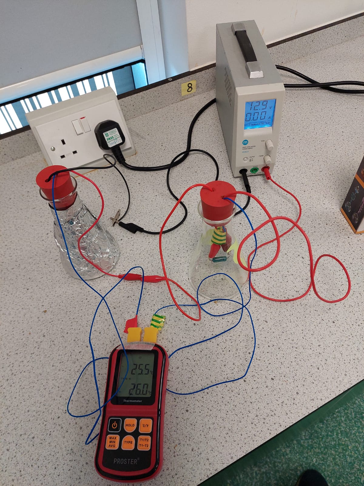
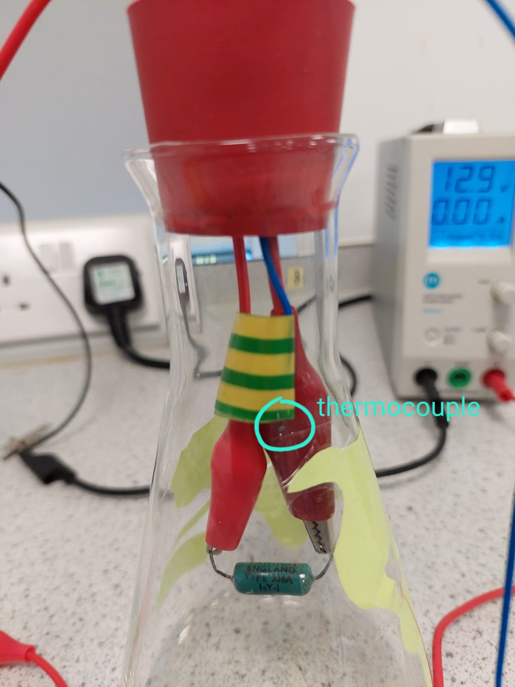
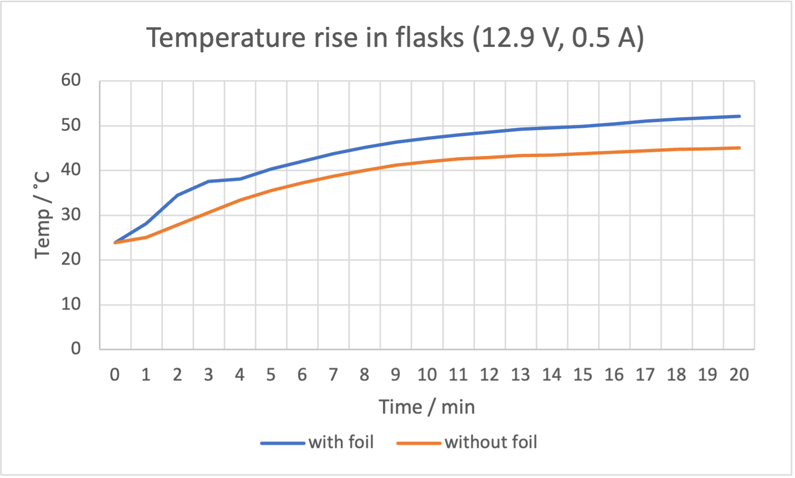

# Greenhouse Effect

**Illustrating the greenhouse effect with hot resistors in flasks**  We gratefully acknowledge funding from Cambridge Zero for the purchase of equipment for this experiment. 

Last initially checked on 2025-02-08 by Duncan Green (dg678@cam.ac.uk)
 and double-checked on 2025-02-08 by John Leung (cfl35@cam.ac.uk)

## Tags
<!--- Start Tags (DO NOT REMOVE THIS COMMENT) --->

**Standard** (A standard CHaOS experiment, useable for all hands-on events.)

**Active** (Experiment has working equipment at the time of last update, and is available for events.)

**Physics**

**Requires Electricity**

<!--- End Tags (DO NOT REMOVE THIS COMMENT) --->

<br/>

## Equipment Needed 
- **Electricity needed**
- Power supply
- Power supply cable (from small Extension Leads)
- Digital thermometer (Dual channel, with two K-type thermocouples)
- 2 Conical flasks (250 ml): one wrapped in aluminium foil, one with ‘continents’ stuck on
- Pre-built circuit with bungs (including leads and resistors)

<br/>

## Experiment Explanation 

### **Setting it up**

1. Take the flasks out of the bubble wrap. Make sure they get wrapped up nicely at the end of the day before going back into the box. 

2. The circuit is pre-built (the leads and resistors are fixed onto the bungs). Simply put the bungs into the flasks, and **adjust the power supply voltage to < 15 V before connecting it to the circuit**. 

<center>
<div style="width:20cm">
 
<i>Fig 1: Circuit setup </i>
</div>
</center>


3. Connect the blue thermocouple wires to the digital thermometer. Also check that the thermocouple heads are fixed in the right place. Thermocouples are not in direct contact with the glass flask or hot metal components to prevent direct heating by conduction. 

<center>
<div style="width:20cm">
 
<i>Fig 2: Thermocouple closeup </i>
</div>
</center>


4. Turn on the power, and the air in the flasks should heat up, starting at the same initial temperature. 

After introducing the setup of the experiment, you can proceed to explain some of the points below when waiting for the flasks to heat up sufficiently. 

Once you reach your desired temperature difference, turn off the power as you continue with the rest of the explanation, so the flasks can cool to room temperature before you repeat the demo to another group. 

<center>
<div style="width:20cm">
 
<i>Fig 3: Trial results</I>
</div>
</center>

Testing at 12.9 V shows that a 20–30 °C rise is achievable over about 20 minutes, and the flask wrapped in foil heats up more than the other one. In practice, your demo will not last that long. I think it works well to aim for a temperature difference of about 5 °C over the first few minutes. You can probably still see a temperature difference over the length of your demo even as the flasks are cooling. 

Note on the resistors: These ‘vintage’ blue-green resistors are from Cavendish Stores, with a _nominal_ power rating of 5 W and resistance about 12 Ohms, so the maximum power supply voltage we should use is about 15 V. In case the resistors blow up, there are a bunch of spares in the box, but they are expensive to buy online…

```math
P = \frac{V^2}{R} = \frac{15^2}{12} = 18.75 V
```

### **Heat Transfer**

Have you ever had a campfire? How does it feel around it?

It feels warm because heat is transferred by…

- Conduction: poor in air compared to metals, but this does contribute to the heating of air inside the flasks.

- Convection: air rises in the flasks, but not much air escapes the flask because the holes are small. 

- **Radiation**: it feels warmer on your front than your back when facing a campfire, because radiation (light we can’t see) travels to you in a straight line and lands on your front – the back is in the ‘shadow’ of the IR radiation. The fire glows orange, but it also glows in the IR. 

Similarly, the Earth is also quite warm and loses heat via radiation. It just isn’t hot enough to glow red hot like a campfire. 

Experiment Note: The thermocouples are fixed at about the same height in both flasks, so convection should not contribute to the temperature difference between flasks. 

Links: 
- What is the electromagnetic spectrum? What are the different types of radiation? What devices make use of EM waves? 
- Can attempt to observe the flasks with IR Camera

### **Resistors**

What are resistors? They dissipate energy in the form of heat.

What is resistance? Maybe something like friction to electricity? You can ask them to rub their hands together and feel them heat up. This is how incandescent light bulbs work (but they are inefficient and waste energy). 

Links:
- What is voltage / potential difference? You can compare electrons passing through a resistor (losing electrical potential energy) to water flowing downhill (losing gravitational potential energy). 

### **The Earth**

Where does Earth get its heat? The Sun. So it’s a bit different to the internal production here with the resistors. 

[TODO] Primordial heat and radiogenic heat. 


[TODO] Greenhouse effect diagrams and explanation. 

[TODO] Types of greenhouse gases. Emissions. Some data on the warming effect. Historical temperature graphs.

Links:
- Renewable energy in Electromagnetism. 
- Tree? 


## Acknowledgements

[TODO]
- Idea website and lab manual
- Cambridge Zero funding
- Cavendish

## Risk Assessment


### **Hazard**: Overloaded Resistors

**Description**: Shrapnel from exploding resistors – cuts and burns, may break glass flasks, and risk of fire. 

**Affected People**: All

**Before Mitigation**: Likelihood: 4, Severity: 4, Overall: 16

**Mitigation**: **Limit power dissipation in each resistor to < 5 W. This means power supply < 15 V if 2 resistors are connected in series. Keep the resistors inside the flasks if they are hot, or if the circuit is on.**

The glass flasks can contain shrapnel from an exploding resistor. 

In case of burns, run affected area under tepid (not cold) water for 10 minutes. Call a first aider. Do not attempt to remove shrapnel from wound. 

**After Mitigation**: Likelihood: 2, Severity: 2, Overall: 4


### **Hazard**: Hot Flasks and Resistors

**Description**: Risk of burns.

**Affected People**: All

**Before Mitigation**: Likelihood: 3, Severity: 3, Overall: 9

**Mitigation**: Resistors will be really hot – do not touch them directly. They are fixed by the crocodile clips on the bungs so there should be no need to handle them directly. If you need to change resistors (if they stop working), make sure they have cooled down before touching them. Flasks are unlikely to reach higher than 60 °C, so they are relatively safe to touch. 

In case of burns, run affected area under tepid (not cold) water for 10 minutes. Call a first aider. 

**After Mitigation**: Likelihood: 1, Severity: 3, Overall: 3


### **Hazard**: Glass Flasks

**Description**: Risk of breakage causing cuts. Risk of flasks cracking due to pressure buildup. 

**Affected People**: All

**Before Mitigation**: Likelihood: 3, Severity: 3, Overall: 9

**Mitigation**: Secure flasks to the table with masking tape if necessary (easily removable and will not leave marks), especially if small kids are around. Keep flasks away from table edges. The bungs have holes drilled on top (where the leads come out). They are not airtight, so gas can escape when the flasks are heated. **Do not seal the holes on top the bungs, otherwise the flasks may crack during heating.**

**After Mitigation**: Likelihood: 2, Severity: 3, Overall: 6


### **Hazard**: Aluminium Foil and Wrapping Material

**Description**: Risk of ingestion and choking. Eating small amounts of aluminium foil or bubble wrap will not cause problems but a bigger piece could cause choking or stomach blockage! 

**Affected People**: Small children

**Before Mitigation**: Likelihood: 2, Severity: 5, Overall: 10

**Mitigation**: Keep out of reach of small children. 

**After Mitigation**: Likelihood: 1, Severity: 5, Overall: 5


## Risk Assessment Check History 

**Check 1**: 2024-02-22 - Timothy Wong (chw55@cam.ac.uk), **Check 2**: 2024-02-22 - Lauren Mason (llm34@cam.ac.uk)

**Check 1**: 2025-02-08 - Duncan Green (dg678@cam.ac.uk), **Check 2**: 2025-02-08 - John Leung (cfl35@cam.ac.uk)

