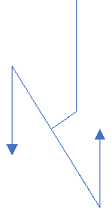

# Spinny Chair

**Use a freely spinning chair, some masses and a bicycle wheel to see some unintuitive physics.**

Last initially checked on 2025-11-23 by Chiara Delpiano-Cordeiro (cd796@cam.ac.uk) and double-checked on 2025-11-27 by Asmita Niyogi (an637@cam.ac.uk)

## Tags
<!--- Start Tags (DO NOT REMOVE THIS COMMENT) --->

**Standard** (A standard CHaOS experiment, useable for all hands-on events.)

**Active** (Experiment has working equipment at the time of last update, and is available for events.)

**Physics**
<!--- End Tags (DO NOT REMOVE THIS COMMENT) --->

 

## Equipment Needed 
- **This experiment can take place outdoors**
- Spinny chair *(Heavy - be careful when lifting)*
- Masses - 2 small and 2 large (bags of rice covered in gaffer tape)
- Bicycle wheel with handles, with spokes covered in cardboard to minimise finger trap risks

 

## Experiment Explanation 

### Overview

By using a spinning chair, weird effects due to conservation of angular momentum can be felt. 

### Set up

Try to make sure the chair is level, there is more than a metre of clear space around it in all directions, and the floor is something that won't graze anyone who lands on it (e.g. carpet). 

Find somewhere convenient to keep the bits of kit so that people don't trip over them. 

If you're unsure that you've got the screws in correctly, check with a committee member. 

### Things to demonstrate:

Demonstrate the effect of the masses by starting the child spinning on the chair with the masses close to their body and then asking them to extend their arms (make sure you do it this way round as otherwise they can pull their arms in and start spinning too fast).

With the child on the ground, start the wheel spinning and then hand it to the child vertically. Ask them to rotate the wheel so that it’s horizontal. They will feel a force in the opposite direction. Ask what they think might happen if they were on the chair.

With the child on the chair, start the wheel spinning vertically and ask them to rotate it to the horizontal. They will start to spin. Ask them if they notice anything about the direction the wheel is spinning vs the way they spin. 

Ask the child to try the experiment with their feet on the floor. The chair will no longer spin. Ask them if they can say why. 

Show the child the difference in the bicycle wheel’s behaviour if you let it dangle freely from the string when it’s not spinning vs when it’s spinning. 
Hold the wheel by one handle with the axis pointing from you to the child - ask them to gently waggle the end up and down, it's heavy but doable.

Start the wheel spinning and repeat - they will find it less controllable.

### Things to be aware of:

Smaller children may not be able to lift the masses. In this case, it’s probably enough for them to just hold their arms and legs out.
Smaller children may also not be able to lift the wheel/ their arms may be too short. Either ask their adult to do it and explain what they feel to their child or sit on the chair yourself to demonstrate the effects (this can be tricky if you make yourself dizzy).

If you’re at a school, make sure you let different kids in the group have a go and get them to explain what they notice to each other. 
There is some potential for slipping off the chair and landing badly. Get people to sit well back on the chair - that way they have good contact with the seat, and they can easily adjust their centre of gyration by leaning forwards. Small children need to be lifted onto the chair. 
Only use moderate speeds when spinning the chair.

Only continue for as long as the child is remaining engaged/ understanding what you’re saying. If you get to the section on precession and feel like the child isn’t following anymore, you can just demonstrate it to them as a cool effect, rather than trying to explain it. 

### Explanation

My general tip here would be don’t get too technical. A lot of the point of this demonstration is to try and get the kids to notice the weird effects and predict what might happen because of them. In general, young kids will not understand vector addition and will quickly get bored if you mention it. 

### The masses

The approach here is age dependent. For younger children who might find moments of inertia and angular momentum a bit complicated, you can ask them to look at how quickly the bags move if you’re spinning at a constant rate with arms out, and compare it with their speed with arms in. It might be helpful here to talk about a runner going round a racetrack - does the runner on the inside or the outside track travel further? If they both complete a lap in the same time, who’s running faster? 

So when your arms are out, the bags will travel faster than when your arms are in (for the same rate of rotation). This means that when you pull the bags in, they’ll now be moving “too quickly” for the rate at which you’re spinning - and so they’ll start to “overtake” you and your arms naturally pull on them to slow them down, speeding you up in the process! The reverse explains why you slow down again when you put your arms out. You can also fit in Newton’s first law here, to explain why the bags don’t slow down until you pull on them. You will probably need to do a lot of acting out holding the bags and demonstrating the direction of forces. 

For older children, you can introduce the idea of angular momentum (or spinniness). Explain that angular momentum depends on two factors. First, the rate at which a system is spinning and second, the distribution of mass within the system (i.e. the moment of inertia). The further away the mass is from the axis of rotation, the larger the moment of inertia is. Next you need to introduce the idea that the angular momentum of a system is a fixed quantity (in a closed system but the distinction doesn’t matter here). This is a strange idea but it can be related to spinning on roundabouts. Ask the child what they would do on a roundabout in order to speed up (lean in) and slow down (lean out). When they lean in they are moving their mass closer to the axis and so decreasing the moment of inertia. To compensate for this reduction in the moment of inertia, the rate of spinning must increase, hence they speed up. 

In a similar way, when they start with the masses close to their chest, they are in effect ‘leaning in’ and the system has a small moment of inertia, meaning a high rate of spin. When they move the bags away, it’s like they’re leaning out and they increase the moment of inertia and so spin more slowly. 

### The wheel and the chair

Ask the child what you have to do to make the wheel start spinning. Hopefully they will say you need to push it/ apply a force. When the child rotates the wheel from the vertical to a horizontal plane, they are changing the axis about which it spins. In the same way that starting an object spinning about an axis requires the application of a force, so does changing the axis about which the object is rotating (in the same way as it requires a force both to start moving and to change your direction of motion). This means that the child must be applying a force to the wheel’s axis in order to rotate it. By Newton’s Third Law, the axis of the wheel is causing an equal and opposite force on the child, which is why they experience a force. (If they’re older you can try and explain the difference between a force and a couple here but it’s not necessary). 

When the child is on the chair, rotating the wheel causes them to start to spin. This is because the force on the child gets transmitted to the seat of the chair, causing a torque which makes the seat spin. 

When it comes to the relative directions of the spin, they should notice that they rotate in the opposite direction to the wheel. Here you can link back to the idea of angular momentum. Explain that the total angular momentum of a system doesn’t change. Initially, the child and the stool were a system with no angular momentum. Then they got the wheel and rotated it so that it lay horizontally. This means that the wheel has some angular momentum oriented along the z axis. In order for the whole system to still have 0 net angular momentum, the child and the stool must rotate in the opposite direction to the wheel so that their angular momentum points in the opposite direction. 

When the child’s feet are on the floor the force is transferred through their feet to the Earth rather than to the chair (this is technically a lie but one I can live with telling children). The Earth has essentially infinite mass and so the force has no visible effect on its motion. (You can draw a comparison with what happens when they jump- when they land they exert a downwards force on the Earth but that doesn’t make the Earth actually move ‘downwards’ as it's so much more massive than they are).

### Precession

(By this stage you may have already lost a few of the younger kids so it's a judgement call as to whether you try and explain the precession or just demonstrate it as a cool effect and mention that you can find similar things in your smartphone to let it know which direction is which).

A fairly intuitive explanation of why the wheel doesn’t fall over is as follows. Consider the direction of the acceleration of two points on the extreme sides of the wheel, due to gravity. Assuming the axis of the wheel tips by some small angle theta, the motion is as drawn below:

Looking at it like this, the wheel should clearly continue to fall over. However, this fails to take into account the fact that all the points on the wheel are rotating around the wheel’s axis and so, half a cycle later, the points shown will be on the opposite side of the wheel. Things that have already started moving in a given direction have a tendency to keep moving in that direction (cf Newton’s First Law) and so the point of the left-hand side will now be moving up and the point on the right down. This creates a rotation in the opposite direction to that caused by gravity, returning the wheel to its original upright position and preventing it from falling over.

(This can also be used as a very hand waving explanation to nutation – the slower the wheel rotates, the longer it takes for the wheel to complete half a rotation and so the further it will fall before the direction of motion reverses again – why nutation is clearer when a top is spinning more slowly) 

This also (kind of) explains why the wheel is harder to push down once it's spinning. By pushing down on the wheel, the child is effectively trying to do what gravity was doing in the above. Thus, their push will be opposed by the wheel while it's spinning for the same reasons that gravity was. 

You can also do a ‘proof by impossibility’. First, go back to the fact that, for an object to rotate about a given axis, there must have been some force applied to cause that rotation. In the case of the wheel it’s obvious; you have to push tangentially on the wheel. Now ask what force makes the wheel rotate round so that it falls over. The answer to this is that gravity causes a torque that makes the wheel rotate about an axis in the x-y plane. Now, consider the case where the wheel was spinning, and it did somehow fall down. It would have to be spinning about the z axis. However, the only force acting on the system was gravity and we already decided that causes a rotation about an axis in the x-y plane. Thus, there are no forces in our system that would cause the wheel to have a rotation about the z axis and, if there are no such forces, there can be no way that the system ends up in this state. 

 

## Risk Assessment

### **Hazard**: Chair

**Description**: Falling off chair.

**Affected People**: Anyone on the chair

**Before Mitigation**: Likelihood: 4, Severity: 3, Overall: 12 (high)

**Mitigation**: Demonstrator must maintain control of the chair and should not allow it to spin at speeds at which there is a significant risk of the child falling off. Starting children with arms tucked in and moving them out to slow down is a good way to ensure this. Make sure that the chair is placed on a flat floor, or grass which is sufficiently flat to ensure stability, with no corners or edges to fall against. If there is an area of flat grass or carpeted or wooden floor, this should ideally be used, though carpet introduces the possibility of grazing - warn the users of the wheel of this. Avoid placing the weights, and other hard objects on the floor haphazardly near the chair, which could injure children if they fall off. Sit well back on the chair to ensure good contact with the seat and allow easy adjustment of the centre of gyration by leaning forwards. Similarly avoid dizziness in both yourself and children by not spinning too fast or for too long.

Call a first aider in the case of an injury.

**After Mitigation**: Likelihood: 3, Severity: 2, Overall: 6 (medium)

 

### **Hazard**: Chair instability (possible incorrect assembly)

**Description**: Chair could fall with a child on it, causing injuries to visitors.

**Affected People**: All

**Before Mitigation**: Likelihood: 2, Severity: 3, Overall: 6 (medium)

**Mitigation**: Stop children/ members of public getting too violent - do not allow them to spin too fast. Ensure chair is on flat ground. Tell children to step off if it is spinning too fast. Stop the chair if it gets out of control. Make sure other children stand away from the chair whilst it is spinning. Use chair with stable base. Small children need to be lifted onto the chair by an accompanying adult to avoid pushing it over.

Demonstrator to ensure the chair is correctly assembled (all parts are labelled). If unsure, ask an experienced member of committee to help.

**After Mitigation**: Likelihood: 1, Severity: 3, Overall: 3 (low)

 

### **Hazard**: Children on chair

**Description**: Hitting someone while spinning

**Affected People**: All around the chair

**Before Mitigation**: Likelihood: 4, Severity: 2, Overall: 8 (high)

**Mitigation**: Keep viewers back, possibly by marking an area with hazard tape. Encourage people not to spin too fast and to stay aware of their surroundings when spinning.

Call a first aider in the case of an injury.

**After Mitigation**: Likelihood: 2, Severity: 2, Overall: 4 (medium)

### **Hzard**: Chair and bags of rice

**Description**: Heavy chair and bags of rice can be dangerous in transport.

**Affected People**: Demonstrator

**Before Mitigation**: Likelihood: 2, Severity: 3, Overall: 6 (medium)

**Mitigation**: The person carrying the equipment should be strong enough to do so, or get someone to help carry it. Use standard manual handling techniques.

Call a first aider in the case of an injury.

**After Mitigation**: Likelihood: 1, Severity: 3, Overall: 3 (low)

 

### **Hazard**: Bike wheel

**Description**: Rotating bicycle wheel could hurt fingers.

**Affected People**: All

**Before Mitigation**: Likelihood: 4, Severity: 4, Overall: 16 (unacceptable)

**Mitigation**: Bicycle wheel is covered in stiff plastic to stop fingers being inserted between spokes. Be ready to help child with rotating wheel if it gets out of control.

Call a first aider in the case of an injury.

**After Mitigation**: Likelihood: 1, Severity: 4, Overall: 4 (medium)

 

### **Hazard**: Bicycle wheel

**Description**: Bicycle wheel is fairly heavy, and could injure people if dropped.

**Affected People**: All

**Before Mitigation**: Likelihood: 3, Severity: 2, Overall: 6 (medium)

**Mitigation**: Demonstrator should assess the size/strength of a child before getting them to hold the gyroscope. If the child cannot hold it comfortably in both hands, with arms horizontal and the wheel easily not touching them then they are too small and/or weak (remember they will have to hold it for a while, and not drop it when it feels like it's fighting them). The demonstrator ought to be ready to take the wheel back if required or help support the wheel by the other handle, and take some time to practice and get a feel for how it moves before demonstrating it to the public (it's not hard to do, but it's difficult to think of why people might drop it if you've not had a play yourself).

Ensure that people (particularly smaller children) don't have the string around their wrist whilst holding the wheel so that it doesn't sprain/damage the wrist if dropped.  Possibly best to wrap it around one of the handles while holding it so it doesn't flail about and hit someone.
Another dropping risk comes from dangling it on the end of a piece of string. This is a good bit of the demo to do, but make sure that the string is both well tied, and not frayed, before doing this. Only do this part of the experiment if the demonstrator is comfortable lifting the wheel. 

Call a first aider in the case of an injury.

**After Mitigation**: Likelihood: 2, Severity: 2, Overall: 4 (medium)

 

## Risk Assessment Check History 

**Check 1**: 2011-12-30 - Mark Durkee (mark.durkee@cantab.net), **Check 2**: 2012-03-14 - Anna Kalorkoti (anna.kalorkoti@cantab.net)

**Check 1**: 2013-01-08 - Ophelia Crawford (oc251@cam.ac.uk), **Check 2**: 2013-01-20 - Richard Hall (rjh216@cam.ac.uk)

**Check 1**: 2014-01-17 - Zephyr Penoyre (jp576@cam.ac.uk), **Check 2**: 2014-01-23 - Vamsee Bheemireddy (vrb23@cam.ac.uk)

**Check 1**: 2015-01-05 - Joseph Hooton (jh795@cam.ac.uk), **Check 2**: 2015-01-22 - Tom Comerford (tafc2@cam.ac.uk)

**Check 1**: 2016-01-03 - Andrei Ruskuc (ar720@cam.ac.uk), **Check 2**: 2016-01-17 - Frances Victoria Western (fvw22@cam.ac.uk)

**Check 1**: 2016-12-29 - Andrei Ruskuc (ar720@cam.ac.uk), **Check 2**: 2017-02-01 - Benjamin Akrill (bja32@alumni.cam.ac.uk)

**Check 1**: 2018-01-13 - Andrew Sellek (ads79@cam.ac.uk), **Check 2**: 2018-01-29 - Lucy Hart (ljfh2@cam.ac.uk)

**Check 1**: 2019-01-07 - Polly Hooton (prh43@cam.ac.uk), **Check 2**: 2019-01-09 - Grace Exley (gae23@cam.ac.uk)

**Check 1**: 2020-01-19 - Daniel Cropper (djc96@cam.ac.uk), **Check 2**: 2020-01-20 - Beatrix Huissoon (beh37@cam.ac.uk)

**Check 1**: 2021-01-12 - Conor Cafolla (ctc43@cam.ac.uk), **Check 2**: 2021-01-12 - Esmae Jemima Woods (ejw89@cam.ac.uk)

**Check 1**: 2022-01-09 - Sophie Miocevich (srm81@cam.ac.uk), **Check 2**: 2022-02-09 - Peter Methley (pm631@cam.ac.uk)

**Check 1**: 2023-01-20 - Jamie Barrett (jb2369@cam.ac.uk), **Check 2**: 2023-01-29 - John Leung (cfl35@cam.ac.uk)

**Check 1**: 2024-01-04 - Andrew Marriott (asm206@cam.ac.uk), **Check 2**: 2024-01-06 - Lucy Bland (lb831@cam.ac.uk)

**Check 1**: 2024-12-27 - Lauren Mason (llm34@cam.ac.uk),**Check 2**: 2025-01-11 - Chiara Delpiano-Cordeiro (cd796@cam.ac.uk)

**Check 1**: 2025-11-23 - Chiara Delpiano-Cordeiro (cd796@cam.ac.uk),**Check 2**: 2025-11-27 - Asmita Niyogi (an637@cam.ac.uk)

