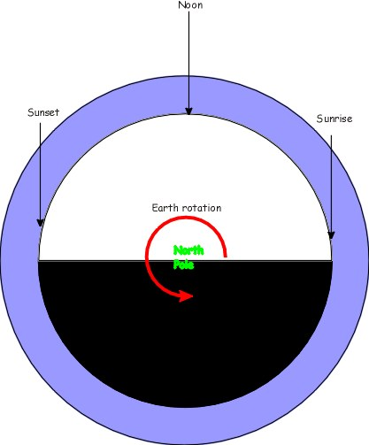

# Sunset Model

**Why is the sky blue and the sunset red?** - Have you ever wondered what makes the sky blue? Or why it stops being blue at sunset? Come along to this experiment to find out why!

Last initially checked on 2024-12-17 by Chiara Delpiano-Cordeiro (cd796@cam.ac.uk) and double-checked on 2024-12-20 by Asmita Niyogi (an637@cam.ac.uk)

## Tags
<!--- Start Tags (DO NOT REMOVE THIS COMMENT) --->

**Standard** (A standard CHaOS experiment, useable for all hands-on events.)

**Minor repairs needed** (The experiment basically works, but could do with some TLC...)

**Physics**
<!--- End Tags (DO NOT REMOVE THIS COMMENT) --->

 

## Equipment Needed 
- **Darkroom needed**
- **Electricity needed**
- Perspex Tube
- Light box stand to sit the tube on
- Milk powder
- Jug
- Power Pack (from the power pack box)

 

## Experiment Explanation 

A perspex tube filled with a jug of water mixed with about 2-3 pinches of milk powder. Light is shone up the tube, and the colours of the sunset can be seen down the tube at different depths of water, and the blue sky can be seen in the side. The experiment needs to be in the darkroom. This probably works better in schools than in a public venue as it does take 10-15+ mins to get all the way through..

The solution works better if it is left to stand for a couple of hours before you start, so if you can pre-mix some the night before that is great.

The concentration of the liquid is important: make sure it isn't too concentrated, or the changes will be masked by the absorption of light by the solution. 

The kids need to be able to see down the tube, so it works better with the tube on the floor.

This can work brilliantly especially with older kids, here is the way I do it:

This experiment is quite unusual for ChaOS in that it can actually be done as an experiment rather than purely as a demonstration though with a large group the experiment has to be quite directed by the demonstrator to stop kids getting bored.. I like to start by essentially saying - "I want you to to find out what happens to the colour of light as it gets shined through a dilute milk powder solution". 

You then get them to fill the tube with the pre-made solution, look at the colour of the light through different depths of liquid, and make a table of depth vs colour.

This could take forever, but if you feed depths to them you can speed it up a lot. You want to distribute them something roughly along the lines of 0cm, 3cm, 6cm, 12cm, 24cm, 40cm.

You should find that the colour of the light bulb (It is worth making it clear that you mean the bulb and not the murk at large depths) goes from white, to yellow to orange, to a dark reddy orange or if you are very lucky red.

If you then get them to tell you what colours of the rainbow there are in white light -> all of them, then start from the bottom of the table and work out what colours are in each colour they have observed (this is of course a simplification as all the colours will work on exponential decays but it works well enough).

You should add these colours as an extra column on the table. and end up with a table looking like:

| Depth of liquid | Colour Observed | Colours of the Rainbow |
| --- | --- | --- |
| 0cm | White | R, O , Y, G, B , I, V |
| 3cm | Whitey Yellow | R, O , Y, G, B , I |
| 6cm | Yellow | R, O , Y, G, B , |
| 12cm | Yellowey orange | R, O , Y, G,  |
| 20cm | Orange | R, O , Y, |
| 30cm | Reddy Orange | R, O  |
| 40cm | Red | R |

You can then ask which colours you loose first from the light → the purples and blues

Where are they going? → if you look in the side of the tube from low down at the bottom, you should see a bluey tinge to the light coming out. 

They are scattering off the little lumps of fat in the milk powder.

You can then go onto ask if they have seen any lights which change from whitish to red, possibly up in the sky... eventually you may get the sun as a response

Explaining this is a lot easier with a diagram, and it works better if you draw it as you go along. Try to get the kids involved in this as much as possible, by asking them to tell you what to draw, or if they are competent and you have time get them to draw it.
- Draw the earth, from the top (so north pole in the middle)

- Draw the sun off to one side

- Ask them what could be getting between you and the sun to change its colour → Air

- Draw on the atmosphere - it should be relatively thin in reality as thick as the skin on an apple

- Draw the half of the earth in shadow

- Mark on sunrise sunset midday and midnight.

- Draw a light beam going to someone standing at midday, and draw a little blue light scattering out

- Draw a light beam going to someone at dawn or dusk through lots of atmosphere

- Draw all the blue light scattering out → leaving the red → red sunset just like in the tube

- Draw someone near this light beam who looks toward the beam going past - what colour will they see? → Blue. What colour is the sky? → blue. Why is the sky blue? → because you are seeing the scattered blue light.

If you can get this final response it makes up for all the labour up to then!

<!--  -->

### A bit more background detail

The scattering in the sky is actually mostly from oxygen and nitrogen molecules not dust.

You might like to know that the process by which the scattering occurs is called Rayleigh scattering (or the Tyndall effect). The scattering cross-section (in effect, the amount of light scattered) is dependent upon $\lambda^{-4}$. This is a very strong wavelength dependence, which explains why the blue light (short wavelength) is scattered more than the red (long wavelength).

Historically, Tyndall and Rayleigh thought that the scattering was due to small particles of dust and water vapour in the atmosphere. However, this is not the case - the scattering takes place from nitrogen and oxygen in the air. If scattering took place off dust, the colour of the sky would be much more variable. Water droplets in clouds tend to scatter all wavelengths of light equally, which is why clouds are white.

Why is the sky blue not violet (since violet is even shorter wavelength)? This is to do with our eyes, which are more sensitive to blue than violet, hence the pale blue colour of the sky.

### Other Interesting Scattering-related phenomena

Dust in the atmosphere *can* enhance the effect, so harvests are often associated with good sunsets due to the dusk kicked up, and after the bunsfield oil depot fire there were some wonderful sunsets in the south east. The scattering of light by atmospheric dust proceeds by Mie Scattering, which has very little wavelength dependence. I found many parents had heard of the sunsets on Mars being blue due to fine dust, which did confuse matters a bit. The distinction here is the dust on Mars is of a particular (Mie) size which scatters red light slightly more.

Mountainous regions are often famous for their blue haze. This stronger than usual scattering of blue light is due to aerosols of terpenes from the vegetation, which react with ozone in the atmosphere to form particles of size ~200 nm which scatter blue light well. Forest fires or volcanic eruptions can cause the opposite effect - they can put particles with a size similar to the wavelength of red light into the atmosphere, which causes the red light to be strongly scattered (scattering is best when the particles are the same size as the wavelength of the light). Therefore we can get effects such as the blue moon (which is rare!), where the moon appears blue because the red light has been scattered out.

There is no atmosphere on the moon, so it has a black sky (nothing for light to scatter off). Mars has a red sky, not due to scattering but because of dust storms disturbing the red dust. If there has been no recent bad weather, the sky should be blue, but darker than the earth's daytime sky because the atmosphere is thinner so less scattering occurs.

 

## Risk Assessment

### **Hazard**: Liquids

**Description**: Spillages present a slip hazard.

**Affected People**: All

**Before Mitigation**: Likelihood: 4, Severity: 3, Overall: 12

**Mitigation**: Clear up any spills promptly. Use wet floor sign if necessary.
Call a first aider in the case of an injury.

**After Mitigation**: Likelihood: 1, Severity: 3, Overall: 3

 

### **Hazard**: Milk

**Description**: Milk powder could cause allergic reactions or if past its best before date could make someone ill.

**Affected People**: All

**Before Mitigation**: Likelihood: 3, Severity: 4, Overall: 12

**Mitigation**: Milk powder and dilute milk solution should not be consumed. Anyone with a milk allergy should avoid handling.

**After Mitigation**: Likelihood: 1, Severity: 4, Overall: 4

 

### **Hazard**: Electrical parts and liquids

**Description**: Tube could topple and spill water, which could come into contact with electrical equipment.

**Affected People**: All

**Before Mitigation**: Likelihood: 4, Severity: 4, Overall: 16

**Mitigation**: Use 7.2V light only. Demonstrator to place power supply/transformer above the surface on which the tube stands. Keep power supply off ground and away from experiment and possible spills. All surrounding mains voltage electrical equipment must be kept clear of the ground, or in a place where it will not be compromised in the event of a major leak. When setting up experiment, pour water into tube away from unprotected electrical equipment (over the low voltage, splash-proofed light box is OK)
Demonstrator must carefully inspect the light box before starting to ensure no damage has occurred which would affect the waterproofing (for example cracking of the light window).
In the event of an accident, turn off electricity and call a first aider.
Also see Electrical Parts RA.

**After Mitigation**: Likelihood: 1, Severity: 3, Overall: 3

 

## Risk Assessment Check History 

**Check 1**: 2011-12-30 - Mark Durkee (mark.durkee@cantab.net), **Check 2**: 2012-02-06 - Rosy Ansell (rosemary.a.r.hunt@gmail.com)

**Check 1**: 2013-01-08 - Ophelia Crawford (oc251@cam.ac.uk), **Check 2**: 2013-01-20 - Richard Hall (rjh216@cam.ac.uk)

**Check 1**: 2014-01-26 - Zephyr Penoyre (jp576@cam.ac.uk), **Check 2**: 2014-02-14 - Nunu Tao (nmt26@cam.ac.uk)

**Check 1**: 2015-01-05 - Joseph Hooton (jh795@cam.ac.uk), **Check 2**: 2015-01-25 - Tom Comerford (tafc2@cam.ac.uk)

**Check 1**: 2016-01-03 - Andrei Ruskuc (ar720@cam.ac.uk), **Check 2**: 2016-01-17 - Frances Victoria Western (fvw22@cam.ac.uk)

**Check 1**: 2016-12-29 - Andrei Ruskuc (ar720@cam.ac.uk), **Check 2**: 2017-02-01 - Matthew Le Maitre (msl54@cam.ac.uk)

**Check 1**: 2018-02-03 - Jared Jeyaretnam (jaj55@alumni.cam.ac.uk), **Check 2**: 2018-02-03 - Andrew Sellek (ads79@cam.ac.uk)

**Check 1**: 2019-02-05 - Conor Cafolla (ctc43@cam.ac.uk), **Check 2**: 2019-02-05 - Polly Hooton (prh43@cam.ac.uk)

**Check 1**: 2020-01-19 - Daniel Cropper (djc96@cam.ac.uk), **Check 2**: 2020-01-25 - Beatrix Huissoon (beh37@cam.ac.uk)

**Check 1**: 2021-01-18 - Polly Hooton (prh43@cam.ac.uk), **Check 2**: 2021-01-19 - Andrew Sellek (ads79@cam.ac.uk)

**Check 1**: 2022-02-05 - Andrew Sellek (ads79@cam.ac.uk), **Check 2**: 2022-02-09 - Maggie Goulden (mcg58@cam.ac.uk)

**Check 1**: 2023-02-18 - Peter Methley (pm631@cam.ac.uk), **Check 2**: 2023-02-18 - Timothy Wong (chw55@cam.ac.uk)

**Check 1**: 2024-01-24 - Lauren Mason (llm34@cam.ac.uk), **Check 2**: 2024-02-15 - Vlad Penzyev (vp410@cam.ac.uk)

**Check 1**: 2024-12-17 - Chiara Delpiano-Cordeiro (cd796@cam.ac.uk), **Check 2**: 2024-12-20 - Asmita Niyogi (an637@cam.ac.uk)
